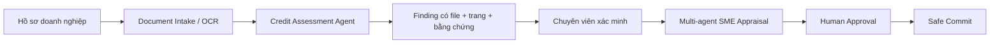

<div align="center">

# DuskDash — SHB Credit AI Platform

### Multi-agent orchestration và microservice rà soát hồ sơ tín dụng có thể kiểm chứng


</div>

---

Nhánh `duccuong` tập hợp hai thành phần độc lập cho quy trình thẩm định tín dụng doanh nghiệp. Cả hai cùng tuân theo nguyên tắc: **LLM hỗ trợ đọc hiểu và diễn giải; rule, policy guard và con người giữ quyền quyết định**.

## Thành phần

| Thư mục | Vai trò | Điểm chính |
|---|---|---|
| [`backend/`](backend/) | Hệ thống multi-agent thẩm định khoản vay SME | Planner động, năm specialist agents, A2A, MCP, HITL và commit an toàn |
| [`credit-assessment-agent/`](credit-assessment-agent/) | Microservice rà soát hồ sơ tín dụng | Đọc OCR Bundle, phát hiện lỗi, dẫn đúng file/trang, giải thích nguyên nhân và đề xuất bước xử lý |

## Bức tranh tổng thể



> Sơ đồ thể hiện hướng tích hợp nghiệp vụ. Hai thư mục hiện có thể chạy và triển khai độc lập.

## Bắt đầu nhanh

### Microservice rà soát hồ sơ

```powershell
cd credit-assessment-agent
python -m venv .venv
.\.venv\Scripts\Activate.ps1
python -m pip install -e ".[dev]"
Copy-Item .env.example .env
python -m pytest -q
python -m uvicorn app.main:app --host 127.0.0.1 --port 8000
```

Hướng dẫn đầy đủ, API contract, kiến trúc và quy trình chạy hồ sơ nằm tại [`credit-assessment-agent/README.md`](credit-assessment-agent/README.md).

### Backend multi-agent

```powershell
cd backend
python -m pip install -r requirements.txt
Copy-Item .env.example .env
python run_all.py
```

Chi tiết các service, protocol và demo nằm tại [`backend/README.md`](backend/README.md).

## Nguyên tắc an toàn

- Không commit `.env`, API key, PDF/ảnh khách hàng, OCR text hoặc assessment thực tế.
- Finding chưa được grounding đầy đủ không được dùng để ra quyết định tự động.
- Quy tắc số học, hard stop và policy threshold phải xác định, version hóa và kiểm thử.
- LLM không có quyền tự phê duyệt hoặc thực thi khoản vay.
- Mọi quyết định cuối cùng đều qua human-in-the-loop và audit trail.

---

<div align="center">

**Grounded evidence · Deterministic policy · Accountable human decision**

</div>
