<div align="center">

# DuskDash — SHB Credit AI Platform

### Multi-agent orchestration và microservice rà soát hồ sơ tín dụng có thể kiểm chứng


</div>

---

Nhánh `duccuong` tập hợp hai thành phần độc lập cho quy trình thẩm định tín dụng doanh nghiệp. Cả hai cùng tuân theo nguyên tắc: **LLM hỗ trợ đọc hiểu và diễn giải; rule, policy guard và con người giữ quyền quyết định**.

## Thành phần

| Thư mục | Vai trò | Điểm chính |
|---|---|---|
| [`backend/`](backend/) | Hệ thống multi-agent thẩm định khoản vay SME | Planner động, năm specialist agents, A2A, MCP, HITL và commit an toàn |
| [`credit-assessment-agent/`](credit-assessment-agent/) | Microservice rà soát hồ sơ tín dụng v2 | Nhận text/data từ upstream, dẫn đúng file/trang và sinh action có căn cứ policy |

## Bức tranh tổng thể

```mermaid
flowchart LR
    A[PDF / ảnh hồ sơ] --> B[Tool 1<br/>Document Intake]
    B --> C[Tool 2<br/>Text & Data Extraction]
    C --> D[ExtractedCaseBundle v2]
    D --> E[Credit Assessment Agent]
    E --> F[Finding có file + trang + bằng chứng]
    F --> G[Policy & Action Registry]
    G --> H[Chuyên viên xác minh]
    H --> I[Multi-agent SME Appraisal]
    I --> J[Human Approval]
    J --> K[Safe Commit]
```



> Sơ đồ thể hiện hướng tích hợp nghiệp vụ. Hai thư mục hiện có thể chạy và triển khai độc lập.

## Bắt đầu nhanh

### Microservice rà soát hồ sơ

```powershell
cd credit-assessment-agent
python -m venv .venv
.\.venv\Scripts\Activate.ps1
python -m pip install -e ".[dev]"
Copy-Item .env.example .env
python -m pytest -q
python -m uvicorn app.main:app --host 127.0.0.1 --port 8000
```

Microservice không nhận PDF/ảnh và không OCR trong runtime. Nếu thiếu policy nội bộ đủ
ID/version/section, decision được giữ ở `PENDING`, action chuyển sang
`MANUAL_POLICY_REVIEW_REQUIRED` và hệ thống không tự gửi yêu cầu cho khách hàng.

- [README và hướng dẫn chạy](credit-assessment-agent/README.md)
- [Báo cáo kiến trúc/đầu vào/đầu ra chi tiết](credit-assessment-agent/BAO_CAO_CHI_TIET_CREDIT_ASSESSMENT_MICROSERVICE.md)
- [Báo cáo ngắn phiên bản v2](credit-assessment-agent/BAO_CAO_NGAN_V2_TEXT_POLICY_ACTION.md)

### Backend multi-agent

```powershell
cd backend
python -m pip install -r requirements.txt
Copy-Item .env.example .env
python run_all.py
```

Chi tiết các service, protocol và demo nằm tại [`backend/README.md`](backend/README.md).

## Nguyên tắc an toàn

- Không commit `.env`, API key, PDF/ảnh khách hàng, text trích xuất hoặc assessment thực tế.
- Finding chưa được grounding đầy đủ không được dùng để ra quyết định tự động.
- Decision/action phải đến từ rule có version, thời gian hiệu lực và căn cứ áp dụng.
- Thiếu policy nội bộ thì không được tự tạo customer action hoặc tự động từ chối/chấp thuận.
- LLM không có quyền tự phê duyệt hoặc thực thi khoản vay.
- Mọi quyết định cuối cùng đều qua human-in-the-loop và audit trail.

---

<div align="center">

**Grounded evidence · Deterministic policy · Accountable human decision**

</div>
