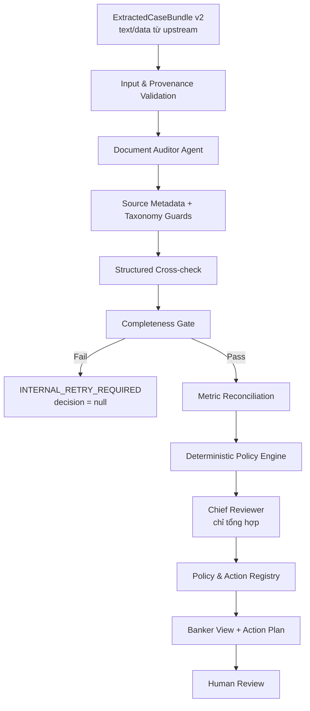

# BÁO CÁO CHI TIẾT CREDIT ASSESSMENT AGENT MICROSERVICE V2

**Phiên bản service:** `0.2.0`

**Input contract:** `ExtractedCaseBundle/2.0`

**Output contract:** `AssessmentReport/2.0`

**Policy code:** `credit-policy-2.0-legal-action-grounded`

**Legal Action Registry:** `VN-CREDIT-LEGAL-BASELINE/1.0.0-2026-07-19`

**Ngày cập nhật:** 19/07/2026
**Trạng thái:** Đã triển khai, kiểm thử và chạy thật một hồ sơ bằng GLM-5.2

---

## 1. Tóm tắt điều hành

`credit-assessment-agent` là microservice FastAPI rà soát hồ sơ tín dụng sau bước tiếp nhận
tài liệu và trích xuất nội dung. Service này không nhận PDF/ảnh và không thực hiện OCR.

Hai công cụ upstream chịu trách nhiệm:

1. Tiếp nhận, kiểm tra và chuẩn hóa PDF/ảnh.
2. Trích xuất text, bảng, trường dữ liệu, confidence và metadata nguồn.

Microservice nhận kết quả của công cụ thứ hai, quét toàn bộ nội dung, phát hiện lỗi/thiếu/mâu
thuẫn, liên kết finding với đúng file và trang, sau đó dùng Policy & Action Engine xác định
chuyên viên cần làm gì tiếp theo.

Điểm thay đổi quan trọng nhất của v2:

- Input public không còn mang nghĩa OCR; chỉ là text/dữ liệu đã trích xuất.
- LLM không được tự đặt hành động, điều luật, người xử lý, SLA hoặc quyết định tín dụng.
- Mỗi hành động phải đến từ rule có ID, version và thời gian hiệu lực.
- Hành động phải chỉ rõ căn cứ pháp lý, căn cứ nội bộ, người xử lý và điều kiện hoàn thành.
- Nếu thiếu policy nội bộ, service trả `MANUAL_POLICY_REVIEW_REQUIRED` và giữ decision ở
  `PENDING`; không tự động gửi yêu cầu cho khách hàng.
- Evidence chưa đủ ngữ cảnh chỉ được đánh dấu `PARTIALLY_VERIFIED` hoặc
  `NEEDS_HUMAN_VERIFICATION`.

Kết quả kiểm chứng cuối:

- `41/41` test đạt.
- Một hồ sơ thật gồm 11 tài liệu/trang đã được GLM-5.2 rà soát đủ `11/11`.
- Service sinh 9 finding và 10 hành động nội bộ có kiểm soát.
- Decision an toàn là `PENDING` vì chưa có policy nội bộ ngân hàng.

---

## 2. Ranh giới hệ thống

### 2.1 Luồng đầu vào thực tế

```text
PDF / ảnh
  ↓
Tool 1 — Document Intake
  - nhận file
  - kiểm tra định dạng
  - tạo document_id/hash
  ↓
Tool 2 — Document Extraction
  - trích xuất text
  - trích xuất bảng/field
  - gắn file, trang, confidence
  ↓
Credit Assessment Microservice
  - không đọc binary
  - không OCR
  - audit + grounding + policy + action
```

### 2.2 Microservice thực hiện

- Validate contract text/data bằng Pydantic v2.
- Kiểm tra manifest, document ID, page count và reference.
- Quét đủ toàn bộ tài liệu/trang; không dừng sau lỗi đầu tiên.
- Kiểm tra bốn lớp: Hard Stop, CIC, Financial Logic, Cross-check.
- Đối soát metric có thể xác minh bằng code.
- Loại false positive từ dataset marker.
- Chuẩn hóa taxonomy và chặn kết luận quá mức của LLM.
- Grounding finding về đúng file, trang, excerpt và confidence upstream.
- Chạy Completeness Gate trước Policy Engine.
- Chạy deterministic Policy Engine.
- Ánh xạ finding sang hành động bằng Policy & Action Registry.
- Tạo Banker View và audit trace cho chuyên viên.

### 2.3 Microservice không thực hiện

- Không nhận PDF/ảnh ở API.
- Không rasterize PDF và không chạy OCR production.
- Không tự tra cứu CIC trực tiếp.
- Không ký hợp đồng, phê duyệt hoặc giải ngân.
- Không gửi email/tin nhắn cho khách hàng.
- Không tự tạo policy nội bộ của ngân hàng.
- Không thay thế Chuyên viên tín dụng, Pháp chế, Tuân thủ hoặc người phê duyệt.

Các script OCR cũ trong `scripts/` chỉ là compatibility/developer utilities dùng để kiểm chứng
bộ dữ liệu hackathon; chúng không nằm trong kiến trúc runtime v2.

---

## 3. Căn cứ để xác định hành động tiếp theo

Không tồn tại một văn bản công khai duy nhất quy định chi tiết cho mọi ngân hàng rằng “finding
X thì vị trí Y phải làm hành động Z”. Hệ thống phải kết hợp ba tầng:

1. Luật và quy định bắt buộc của Nhà nước/Ngân hàng Nhà nước.
2. Quy định nội bộ được từng ngân hàng ban hành.
3. Quy trình sản phẩm, checklist và ma trận thẩm quyền.

Các nguồn chính được version hóa trong registry:

- [Luật Các tổ chức tín dụng số 32/2024/QH15 và các sửa đổi hiện hành](https://vbpl.vn/TW/Pages/vbpq-toanvan.aspx?ItemID=166170): hồ sơ chứng minh năng lực tài chính, mục đích sử dụng vốn, thẩm định/quyết định và lưu trữ hồ sơ.
- [Thông tư 39/2016/TT-NHNN và các sửa đổi hiện hành](https://vbpl.vn/nganhangnhanuoc/Pages/vbpq-print.aspx?ItemID=118230&dvid=326): điều kiện vay, tài liệu khách hàng, thẩm định và yêu cầu tổ chức tín dụng ban hành quy định nội bộ.
- [Thông tư 15/2023/TT-NHNN](https://vbpl.vn/nganhangnhanuoc/Pages/vbpq-thuoctinh.aspx?ItemID=163727): hoạt động thông tin tín dụng của Ngân hàng Nhà nước.
- [Thông tư 27/2025/TT-NHNN](https://vbpl.vn/nganhangnhanuoc/Pages/vbpq-toanvan.aspx?ItemID=182189): yêu cầu quản trị rủi ro và quy trình phòng, chống rửa tiền hiện hành.
- [Nghị định 21/2021/NĐ-CP](https://vbpl.vn/TW/Pages/vbpq-toanvan.aspx?ItemID=147004): biện pháp bảo đảm thực hiện nghĩa vụ.

Hệ quả thiết kế:

- Pháp luật định nghĩa nghĩa vụ và giới hạn bắt buộc.
- Policy nội bộ mới xác định ngưỡng CIC/DTI/DSCR, ngoại lệ, vị trí xử lý và thẩm quyền.
- Không được suy ra “CIC nhóm 3–5 luôn tự động từ chối” nếu chưa có rule nội bộ áp dụng.
- Không được tự gửi yêu cầu bổ sung tài liệu nếu chưa có checklist sản phẩm xác nhận tài liệu đó
  là bắt buộc.

Thứ tự ưu tiên:

```text
Luật bắt buộc
  > Quy định Ngân hàng Nhà nước
  > Policy nội bộ ngân hàng
  > Quy trình sản phẩm
  > Câu diễn giải của LLM
```

Nếu policy nội bộ xung đột quy định bắt buộc, hồ sơ phải bị chặn và chuyển Pháp chế/Tuân thủ.

---

## 4. Kiến trúc v2



### 4.1 Các bất biến ngoài prompt

1. `expected_pages == reviewed_pages` trước khi chạy Policy Engine.
2. Mỗi trang có page ledger kể cả khi không có finding.
3. Bốn lớp kiểm tra phải được hoàn thành.
4. Finding critical/high chưa grounding không được kích hoạt quyết định tự động.
5. Policy Engine sở hữu decision candidate; Chief Reviewer không được thay đổi.
6. Action Engine chỉ đọc category/grounding/policy registry; không dùng action do LLM tự viết.
7. Rule hết hiệu lực không được sử dụng.
8. Customer action chỉ xuất hiện khi có căn cứ policy nội bộ đầy đủ.

### 4.2 Thành phần mã nguồn

| Thành phần | File/thư mục | Chức năng |
|---|---|---|
| Input v2 | `app/schemas/input_extracted_bundle.py` | Contract text/data và compatibility alias |
| Legacy input | `app/schemas/input_ocr_bundle.py` | Tương thích tạm thời với payload cũ |
| Auditor | `app/agents/document_auditor.py` | Quét trang/chunk và phát hiện issue |
| Prompt guard | `app/agents/prompts.py` | Cấm LLM tự đặt decision/action/policy |
| Completeness | `app/engine/completeness_gate.py` | Chặn hồ sơ thiếu/không đọc được |
| Metric | `app/engine/metric_extractor.py` | Đối soát DTI từ toán hạng có nguồn |
| Cross-check | `app/engine/structured_crosscheck.py` | Đối chiếu trường định danh có cấu trúc |
| Taxonomy | `app/engine/issue_taxonomy_guard.py` | Chặn false hard stop và so sánh sai phạm vi |
| Decision | `app/engine/policy_engine.py` | Decision candidate xác định |
| Action | `app/engine/action_recommendation_engine.py` | Finding → rule → next action |
| Registry | `app/policy/legal_action_registry_v1.json` | Legal baseline có version/effective date |
| Banker View | `app/reporting/banker_view.py` | File/trang/excerpt/grounding/action plan |
| Output | `app/schemas/output_report.py` | AssessmentReport v2 |
| API | `app/api/v1/` | Assess, polling, health |

---

## 5. Đầu vào `ExtractedCaseBundle v2`

### 5.1 API

```http
POST /v1/assess
Content-Type: application/json
```

### 5.2 Cấu trúc cấp hồ sơ

| Field | Kiểu | Bắt buộc | Ý nghĩa |
|---|---|---:|---|
| `schema_version` | `"2.0"` | Có | Phiên bản contract |
| `case_id` | string | Có | Mã lượt xử lý |
| `customer_id` | string | Có | Mã khách hàng |
| `product_code` | string/null | Không | Sản phẩm tín dụng |
| `source_system` | string/null | Không | Hệ thống upstream |
| `document_manifest` | object | Có | Danh sách tài liệu và số trang kỳ vọng |
| `pages` | array | Có thể rỗng | Text/data từng trang |
| `policy_context` | object/null | Không | Policy nội bộ đã phê duyệt |

### 5.3 Manifest

Mỗi document có:

- `document_id` duy nhất.
- `document_type`.
- `page_count >= 1`.
- `sha256` 64 ký tự hex.
- `source_filename` và `document_title` nếu upstream cung cấp.

Validator kiểm tra:

- `total_documents == len(documents)`.
- `total_pages == sum(page_count)`.
- Không trùng `document_id`.
- Không có page ngoài manifest hoặc vượt `page_count`.
- Không trùng `(document_id, page_number)`.
- Không nhận field/binary lạ như `pdf_bytes`.

### 5.4 Trang dữ liệu trích xuất

| Field | Kiểu | Ý nghĩa |
|---|---|---|
| `document_id` | string | Tài liệu nguồn |
| `page_number` | integer | Trang vật lý/logic của nguồn |
| `block_id` | string/null | ID đoạn nếu upstream có |
| `text` | string | Text đã trích xuất |
| `tables` | array | Bảng có `name` và `rows` |
| `extracted_fields` | object | Field/value hoặc metadata upstream |
| `extraction_confidence` | 0..1 | Độ tin cậy trích xuất |
| `quality_flag` | enum | `OK`, `BLURRY`, `ROTATED`, `BLANK`, `UNREADABLE` |

Chỉ gửi một chuỗi text nối toàn bộ hồ sơ là không đủ. `document_id`, `source_filename`,
`page_number` và confidence phải được giữ để chứng minh finding ở đâu.

### 5.5 Ví dụ rút gọn

```json
{
  "schema_version": "2.0",
  "case_id": "CASE-001",
  "customer_id": "CUS-001",
  "product_code": "SME_WORKING_CAPITAL",
  "document_manifest": {
    "total_documents": 1,
    "total_pages": 1,
    "documents": [
      {
        "document_id": "DOC-001",
        "document_type": "DANG_KY_KINH_DOANH",
        "page_count": 1,
        "sha256": "aaaaaaaaaaaaaaaaaaaaaaaaaaaaaaaaaaaaaaaaaaaaaaaaaaaaaaaaaaaaaaaa",
        "source_filename": "dang-ky-doanh-nghiep.pdf"
      }
    ]
  },
  "pages": [
    {
      "document_id": "DOC-001",
      "page_number": 1,
      "text": "Mã số doanh nghiệp: 0318888888...",
      "tables": [],
      "extracted_fields": {"business_id": "0318888888"},
      "extraction_confidence": 0.96,
      "quality_flag": "OK"
    }
  ]
}
```

Contract cũ dùng `ocr_pages`, `ocr_text`, `ocr_fields`, `ocr_confidence` vẫn được nhận tạm thời
qua validation alias. Khi serialize lại, payload trở về tên field v2.

---

## 6. `policy_context`

`policy_context` là dữ liệu do ngân hàng phê duyệt; LLM không được tạo. Cấu trúc hiện tại:

| Field | Ý nghĩa |
|---|---|
| `policy_id` | Mã quy định nội bộ |
| `policy_version` | Phiên bản áp dụng |
| `effective_from` | Ngày bắt đầu hiệu lực |
| `required_document_types` | Checklist loại tài liệu bắt buộc |
| `verified_metric_names` | Metric đã được xác minh nguồn |
| `action_rule_sections` | Mapping category → điều/mục policy nội bộ |

Một policy chỉ có tên/version nhưng không có ngày hiệu lực và section chưa đủ để phát hành
customer action.

Khi thiếu policy:

- `decision_recommendation = PENDING`.
- Warning có `BANK_DECISION_POLICY_NOT_CONFIGURED`.
- Action plan có `ACT-CASE-BANK-POLICY-REQUIRED`.
- `manual_policy_review_required = true`.
- `customer_actions = []`.
- `can_submit_for_approval = false`.

---

## 7. Quy trình xử lý chi tiết

### 7.1 Input validation

FastAPI/Pydantic từ chối request sai schema bằng HTTP 422. Service không tự điền dữ liệu còn
thiếu hoặc nhận binary ngoài contract.

### 7.2 Idempotency

Idempotency key được băm từ case/customer, manifest, nội dung request, prompt version và policy
version. Cùng input trong cùng process trả cache; input thay đổi tạo job mới.

Cache hiện là in-memory và chưa phù hợp multi-replica production.

### 7.3 Document Auditor

Auditor nhận text/data v2 và phải:

- Đọc đủ mọi trang.
- Không dừng khi thấy Hard Stop.
- Không ra quyết định tín dụng.
- Mỗi issue có location và evidence.
- `UNKNOWN` không được coi là `PASS`.

Hồ sơ trên bốn trang được chia chunk. Từng chunk phải trả đúng page ledger được giao. Sau đó
Reconciliation Agent hợp nhất issue và phát hiện mâu thuẫn giữa chunk.

Mọi JSON LLM đều qua strict Pydantic validation. Nếu LLM trả sai schema, hệ thống ghi lỗi,
đưa validation feedback vào lượt repair và không phát hành artifact sai.

### 7.4 Guard và cross-check

Các guard chạy ngoài LLM:

- Loại footer mô phỏng lặp lại khỏi finding gian lận.
- Không biến thiếu vốn đối ứng/điều kiện trước giải ngân thành Hard Stop.
- Đối chiếu CCCD, ngày sinh, ngày hoạt động có cấu trúc.
- Chặn so sánh khác phạm vi, ví dụ “vay dài hạn BCTC” với “tổng dư nợ CIC”.
- Với phép so sánh khác phạm vi, hệ thống yêu cầu tính lại thay vì kết luận khách hàng che giấu nợ.

### 7.5 Evidence grounding

Mỗi evidence source hỗ trợ cả:

```text
DOC-001#page=1
DOC-001:1
```

Grounding tạo danh sách nguồn gồm:

- `document_id`.
- `source_filename`.
- `document_title`.
- `page_number`.
- `source_excerpt`.
- `extraction_confidence`.

Trạng thái:

| Status | Ý nghĩa |
|---|---|
| `VERIFIED` | Value và excerpt có ngữ cảnh khớp text nguồn |
| `PARTIALLY_VERIFIED` | Value tồn tại nhưng nhãn/ngữ cảnh chưa đủ hoặc một nguồn chưa mạnh |
| `NEEDS_HUMAN_VERIFICATION` | Chưa đủ chứng cứ xác nhận claim |
| `INVALID_SOURCE_REFERENCE` | Source không tồn tại trong input |

Một giá trị số xuất hiện đơn lẻ không còn đủ để được coi là `VERIFIED`.

### 7.6 Completeness Gate

Gate chỉ pass khi:

- Reviewed documents bằng expected documents.
- Reviewed pages bằng expected pages.
- Không có trang missing/unreadable.
- Có page ledger cho toàn bộ manifest.
- Bốn lớp kiểm tra đã hoàn thành.

Nếu fail:

- `processing_status = INTERNAL_RETRY_REQUIRED` hoặc manual processing.
- `decision_recommendation = null`.
- Không chạy decision/action như một hồ sơ hoàn chỉnh.
- Lỗi kỹ thuật upstream không được coi là lỗi khách hàng.

### 7.7 Policy Engine

Policy Engine tính lại DTI/DSCR khi có toán hạng, nhưng chỉ cho phép metric ảnh hưởng decision
khi nguồn và policy được xác minh.

Ngưỡng hard-code cũ không còn được dùng để tự động reject hồ sơ thật thiếu policy. Nếu request
không cung cấp policy đủ điều kiện, engine trả:

```json
{
  "decision_candidate": "PENDING",
  "reasons": ["MANUAL_POLICY_REVIEW_REQUIRED"],
  "decision_input_warnings": [
    "REQUIRED_DOCUMENT_CHECKLIST_NOT_PROVIDED",
    "BANK_DECISION_POLICY_NOT_CONFIGURED"
  ]
}
```

### 7.8 Chief Reviewer

Chief Reviewer chỉ:

- Tổng hợp issue đã validation.
- Giữ toàn bộ finding.
- Diễn giải decision candidate do Policy Engine đưa ra.
- Tạo nội dung review/human focus.

Chief Reviewer không phải người phê duyệt và không được tự đặt rule/action.

### 7.9 Policy & Action Engine

Engine nhận `ActionableFinding` đã grounding và tìm rule còn hiệu lực theo category.

Nếu finding chưa `VERIFIED`, hành động đầu tiên luôn là:

```text
VERIFY_EXTRACTED_SOURCE
```

Nếu rule yêu cầu policy nội bộ nhưng request không cung cấp đủ căn cứ:

```text
MANUAL_POLICY_REVIEW_REQUIRED
```

Engine không đọc `suggested_customer_action`, `resolution_steps` hoặc điều luật do LLM tạo để
quyết định hành động.

---

## 8. Policy & Action Registry

### 8.1 Cấu trúc rule

Mỗi `PolicyActionRule` có:

- `rule_id`, `version`.
- `effective_from`, `effective_to`.
- `issue_category`.
- `action_type`, `owner_role`, `audience`.
- `requirement_level`.
- `why_required`.
- `legal_basis[]`.
- `required_evidence[]`.
- `completion_criteria[]`.
- `blocking_stage`.
- `next_state_after_completion`.
- `requires_bank_policy`.
- `priority`.

### 8.2 Legal basis

Mỗi căn cứ có:

- Tên văn bản.
- Điều/mục.
- URL chính thức.
- Ngày hiệu lực.
- Source version.
- Ngày hệ thống kiểm tra nguồn gần nhất.

### 8.3 Rule baseline hiện có

| Category | Action | Owner | Ghi chú |
|---|---|---|---|
| `HARD_STOP` | `LEGAL_REVIEW` | Legal | Không tự reject nếu chưa phân loại đúng luật/policy |
| `CIC_RED_FLAG` | `CIC_RECHECK` | Credit Appraiser | Cần policy CIC nội bộ |
| `FINANCIAL_LOGIC_FAIL` | `RECALCULATE` | Credit Appraiser | Tính lại từ toán hạng cùng nguồn/kỳ |
| `CROSS_CHECK_MISMATCH` | `VERIFY_EXTRACTED_SOURCE` | Credit Appraiser | Xác định nguồn thắng và ngữ cảnh |
| `MINOR_DISCREPANCY` | `VERIFY_EXTRACTED_SOURCE` | Credit Appraiser | Phân biệt lỗi extraction và lỗi chứng từ |
| `MISSING_DOCUMENT` | `REQUEST_DOCUMENT` | Relationship Manager | Chỉ phát hành khi checklist nội bộ xác nhận |
| `PRE_DISBURSEMENT_CONDITION` | `COLLATERAL_REVIEW` | Collateral/Legal | Chặn trước giải ngân, không tự reject |
| `POLICY_REVIEW_REQUIRED` | `POLICY_REVIEW` | Credit Appraiser | Cần chuyên viên phân loại rule |

Rule hết `effective_to` không được dùng. Nếu không còn rule active, engine sinh
`NO-ACTIVE-RULE` và giữ manual review.

---

## 9. Đầu ra `AssessmentReport v2`

### 9.1 Envelope

`POST /v1/assess` trả:

| Field | Ý nghĩa |
|---|---|
| `job_id` | ID deterministic từ idempotency key |
| `idempotency_key` | Hash input/prompt/policy |
| `cached` | Có lấy từ cache hay không |
| `report` | AssessmentReport v2 |

### 9.2 AssessmentReport

Các nhóm chính:

- `processing_status`.
- `scan_completeness`.
- `decision_recommendation` và `decision_summary`.
- `key_financial_metrics`.
- `all_issues`.
- `missing_or_incomplete_documents`.
- `consolidated_customer_requests`.
- `approval_conditions_if_applicable`.
- `human_review_required/focus`.
- `banker_view`.
- `audit_trace`.

### 9.3 Banker View

`banker_view` trả:

- Tổng số finding theo severity/grounding.
- Có thể trình phê duyệt hay không.
- Mỗi finding có file, trang, excerpt và action IDs.
- Danh sách customer action đã được policy cho phép.
- Internal next steps.
- Trạng thái checklist.
- `action_plan` có căn cứ.

### 9.4 RecommendedAction

```json
{
  "action_id": "ACT-ISSUE-005-VN-FINANCIAL-CAPACITY-RECALCULATE",
  "finding_ids": ["ISSUE-005"],
  "action_type": "RECALCULATE",
  "owner_role": "CREDIT_APPRAISER",
  "requirement_level": "REQUIRED_BY_LAW",
  "action_status": "READY_FOR_HUMAN_EXECUTION",
  "audience": "INTERNAL",
  "why_required": "Khả năng trả nợ phải được thẩm định từ dữ liệu có nguồn.",
  "legal_basis": ["..."],
  "bank_policy_basis": [],
  "required_evidence": ["Các toán hạng cùng kỳ và cùng chủ thể"],
  "completion_criteria": ["Tính lại và lưu nguồn từng toán hạng"],
  "blocking_stage": "APPROVAL",
  "next_state_after_completion": "REASSESS",
  "requires_human_confirmation": true,
  "source_rule_id": "VN-FINANCIAL-CAPACITY-RECALCULATE",
  "source_rule_version": "1.0.0"
}
```

### 9.5 Tách ba nhóm hành động

- `customer_actions`: chỉ action được phép gửi khách hàng.
- `internal_actions`: việc Chuyên viên/Pháp chế/Tuân thủ thực hiện nội bộ.
- `regulatory_escalations`: xử lý chuyên biệt; không đưa chi tiết nhạy cảm vào yêu cầu khách hàng.

---

## 10. API

### `POST /v1/assess`

Xử lý đồng bộ, validate `ExtractedCaseBundle v2`, trả `AssessmentExecution`.

### `GET /v1/assess/{job_id}`

Đọc lại report đã lưu trong cache process. Nếu không có trả 404.

### `GET /health`

```json
{"status": "ok", "service": "credit-assessment-agent"}
```

Swagger: `http://127.0.0.1:8000/docs`.

---

## 11. Cấu hình và cách chạy

### 11.1 Cài đặt

```powershell
python -m venv .venv
.\.venv\Scripts\Activate.ps1
python -m pip install -e ".[dev]"
Copy-Item .env.example .env
```

### 11.2 GLM-5.2

```dotenv
LLM_MODE=glm
GLM_API_KEY=<secret>
GLM_MODEL=GLM-5.2
GLM_BASE_URL=https://mkp-api.fptcloud.com
```

Không commit `.env`.

### 11.3 Chạy API

```powershell
python -m uvicorn app.main:app --host 127.0.0.1 --port 8000
```

### 11.4 Chạy một hồ sơ text/data

```powershell
python scripts\run_single_extracted_case.py `
  "artifacts\actual-input\cty-cp-vinanova.ocr-bundle.json" `
  "artifacts\single-case-v2-vinanova" `
  --mode glm `
  --write-normalized-input
```

Script lưu:

- Input canonical v2.
- JSON assessment đầy đủ.
- Markdown report cho chuyên viên.
- Thời gian, call metrics và token usage.

### 11.5 Chạy test

```powershell
python -m pytest -q
```

---

## 12. Kết quả kiểm thử

Kết quả cuối:

```text
......................................... [100%]
41 passed
```

Nhóm kiểm thử:

| Nhóm | Nội dung |
|---|---|
| Input v2 | Tên field canonical, compatibility v1, từ chối binary/field lạ |
| API | Health, POST, polling, 422 |
| Auditor | Không dừng sớm, đủ page ledger, retry/validation |
| Completeness | Missing/unreadable chặn decision |
| Grounding | File, trang, excerpt, nhiều evidence source |
| Taxonomy | Dataset marker, hard stop, điều kiện trước giải ngân |
| Metric | DTI operands và reconciliation |
| Policy | Deterministic decision và thiếu policy → PENDING |
| Action | Deterministic mapping, rule hết hạn, customer action guard |
| GLM adapter | JSON/fence/schema và metrics |

Một cảnh báo dependency còn lại: `StarletteDeprecationWarning` về `httpx` trong TestClient; không
làm test thất bại và cần xử lý khi nâng dependency.

---

## 13. Kết quả chạy một hồ sơ thật

Hồ sơ: **Công ty Cổ phần Bao bì VinaNova**.

### 13.1 Hiệu năng

| Chỉ số | Kết quả |
|---|---:|
| Tài liệu/trang upstream | 11/11 |
| Trang được review | 11/11 |
| Thời gian end-to-end | 272.029 giây |
| Lượt gọi GLM-5.2 | 6 |
| Tổng token | 86.094 |
| Finding | 9 |
| `VERIFIED` | 2 |
| Cần xác minh thêm | 7 |
| Next actions | 10 |
| Customer actions | 0 |
| Decision | `PENDING` |
| Có thể trình phê duyệt | Không |

Lượt gọi GLM đầu tiên trả sai schema. Strict validator chặn kết quả, gửi validation feedback và
lượt repair thành công. Không có output lỗi nào được phát hành.

### 13.2 Finding

| ID | Nội dung | Nguồn | Grounding |
|---|---|---|---|
| ISSUE-001 | Mã số đơn lẻ ở phiếu tóm tắt không khớp mã doanh nghiệp; nhãn của giá trị đầu chưa đủ mạnh | DOC-001 p1 + DOC-002 p1 | PARTIALLY_VERIFIED |
| ISSUE-002 | Tên đơn vị kiểm toán giữa hai trang không nhất quán | DOC-005 p1 + DOC-007 p1 | PARTIALLY_VERIFIED |
| ISSUE-003 | Hệ số thanh toán/nợ-vốn chủ sở hữu không khớp | DOC-005 p1 + DOC-006 p1 | PARTIALLY_VERIFIED |
| ISSUE-004 | 270 tỷ và 1.018,5 tỷ có thể là khác khái niệm vốn | DOC-005 p1 + DOC-006 p1 | PARTIALLY_VERIFIED |
| ISSUE-005 | Phép so vay dài hạn với tổng dư nợ CIC khác phạm vi; không được kết luận thiếu 42 tỷ | DOC-006 p1 + DOC-008 p1 | VERIFIED |
| ISSUE-006 | Sao kê 2023–2024 không cùng kỳ dữ liệu 2025/2026 | DOC-011 p1 + DOC-010 p1 | VERIFIED |
| ISSUE-007 | Claim thiếu BCTC chi tiết chưa có checklist sản phẩm | DOC-001 p1 | NEEDS_HUMAN_VERIFICATION |
| ISSUE-008 | Claim thiếu BCTC quản trị 6T2025 chưa có checklist nội bộ | DOC-009 p1 | NEEDS_HUMAN_VERIFICATION |
| ISSUE-009 | Chênh lệch doanh thu BCTC/HĐĐT/VAT dưới 1% cần kiểm tra thời điểm ghi nhận | DOC-010 p1 | NEEDS_HUMAN_VERIFICATION |

### 13.3 Cách hiểu kết quả

`PENDING` không phải lỗi hệ thống. Đây là trạng thái đúng vì:

- Input không có policy nội bộ đủ ID/version/section.
- Bảy finding chưa đủ grounding để dùng cho quyết định.
- Hai claim thiếu tài liệu chưa được checklist ngân hàng xác nhận.
- Service không có quyền tự đặt yêu cầu khách hàng hoặc phê duyệt.

### 13.4 Việc Chuyên viên cần làm

1. Mở đúng hai nguồn của các finding cross-check và xác nhận ngữ cảnh/nhãn.
2. Tính lại tổng vay ngắn hạn + dài hạn trên BCTC, so CIC tại cùng ngày.
3. Xác định policy sản phẩm có yêu cầu sao kê cùng kỳ hoặc sao kê mới hay không.
4. Cung cấp policy nội bộ, checklist sản phẩm và ma trận thẩm quyền.
5. Chạy lại; chỉ phát hành customer action khi rule chuyển sang
   `READY_FOR_HUMAN_EXECUTION`.

---

## 14. Bảo mật và quản trị dữ liệu

- `.env` và API key bị ignore.
- PDF/ảnh, text bundle, assessment và report thật không được commit.
- Log production cần masking dữ liệu cá nhân.
- Cần mã hóa at-rest/in-transit.
- Cần RBAC theo vai trò Chuyên viên, Pháp chế, Tuân thủ, người phê duyệt.
- Cần audit sink bất biến cho rule version, prompt version và human action.
- Dữ liệu AML/regulatory escalation không được đưa vào customer request.
- Chính sách retention phải theo quy định và policy ngân hàng.

---

## 15. Giới hạn hiện tại

1. Chưa có policy nội bộ thực tế của ngân hàng.
2. Cache là in-memory, không chia sẻ giữa replica.
3. API xử lý đồng bộ; hồ sơ lớn có latency cao.
4. Chưa có authentication, authorization, rate limit và queue.
5. Legal registry cần quy trình review định kỳ khi văn bản thay đổi.
6. Một số financial comparison vẫn cần calculator engine tổng quát hơn.
7. Grounding text không thay thế mở tài liệu gốc tại upstream UI.
8. GLM có thể trả sai schema; retry làm tăng thời gian/token.
9. Chưa có golden set do chuyên viên ngân hàng gắn nhãn.
10. Chưa có production CIC/AML/collateral connectors.

---

## 16. Việc cần bổ sung để production pilot

### Bắt buộc từ ngân hàng

- Quy định cấp tín dụng nội bộ hiện hành.
- Checklist tài liệu theo từng sản phẩm.
- Rule CIC, DTI, DSCR và khẩu vị rủi ro.
- Ma trận thẩm quyền/phê duyệt.
- Quy trình tài sản bảo đảm và định giá.
- KYC/AML risk và escalation SOP.
- Quy trình ngoại lệ/waiver.
- Tên vai trò, SLA và điều kiện đóng action.

### Kỹ thuật

- Policy registry có chữ ký/hash và workflow phê duyệt.
- Redis/database cho idempotency và job state.
- Queue/worker cho hồ sơ dài.
- OpenTelemetry, metrics và alert.
- Authentication, RBAC và immutable audit log.
- Golden set và regression suite nghiệp vụ.

---

## 17. Definition of Done v2

| Tiêu chí | Trạng thái |
|---|---|
| Runtime không nhận PDF/ảnh | Đạt |
| Input public là text/data v2 | Đạt |
| Giữ file/trang/confidence | Đạt |
| Compatibility payload v1 | Đạt |
| Quét đủ mọi trang | Đạt |
| Completeness Gate | Đạt |
| Evidence hỗ trợ nhiều source | Đạt |
| Giá trị đơn lẻ không tự VERIFIED | Đạt |
| LLM không sở hữu decision/action | Đạt |
| Legal action registry có version/effective date | Đạt |
| Rule hết hiệu lực bị loại | Đạt |
| Thiếu bank policy → manual review | Đạt |
| Thiếu policy không tạo customer action | Đạt |
| Test suite | 41/41 đạt |
| Chạy GLM một hồ sơ thật | Thành công |
| Policy nội bộ ngân hàng thực tế | Chưa được cung cấp |
| Production infra/security | Chưa thuộc bản hackathon |

---

## 18. Tài liệu và artifact

Trong workspace kiểm chứng cục bộ:

- `BAO_CAO_NGAN_V2_TEXT_POLICY_ACTION.md` — bản tóm tắt.
- `artifacts/single-case-v2-vinanova/*.extracted-v2.json` — input canonical.
- `artifacts/single-case-v2-vinanova/*.assessment-v2.json` — output đầy đủ.
- `artifacts/single-case-v2-vinanova/*.assessment-v2.md` — báo cáo chuyên viên.

Artifact chứa dữ liệu hồ sơ không được đưa lên GitHub.

---

## 19. Kết luận

Phiên bản v2 đã chuyển microservice từ mô hình “nhận OCR Bundle và đưa lời khuyên” thành một
dịch vụ rõ ranh giới hơn:

```text
text/data có nguồn
  → finding có file/trang
  → grounding
  → policy rule có version
  → action có người xử lý/căn cứ/điều kiện hoàn thành
  → human decision
```

Hệ thống hiện đã phù hợp để pilot ở vai trò **trợ lý rà soát hồ sơ và điều phối bước xử lý tiếp
theo**, nhưng chưa được dùng để phê duyệt/từ chối tự động. Để đạt độ chính xác theo một ngân
hàng cụ thể, bắt buộc phải nạp policy nội bộ và checklist sản phẩm của chính ngân hàng đó.
