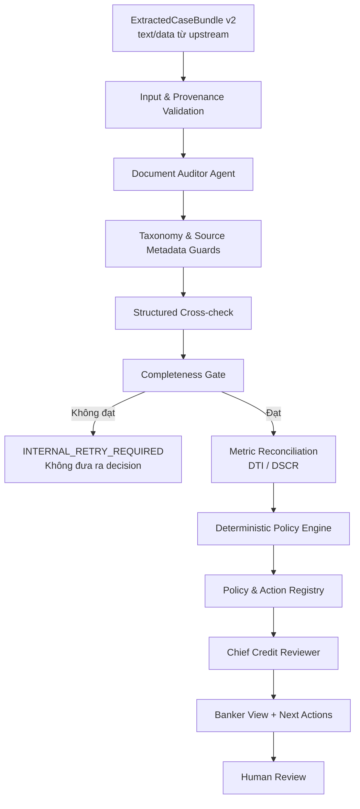

<div align="center">

# Credit Assessment Agent

### Microservice rà soát hồ sơ tín dụng có dẫn chứng đến từng file và từng trang


**Không chỉ trả về một kết luận. Hệ thống chỉ rõ lỗi gì, nằm ở đâu, vì sao là lỗi, ảnh hưởng thế nào và chuyên viên cần làm gì tiếp theo.**

</div>

---

## Bài toán được giải quyết

Microservice nhận **ExtractedCaseBundle v2** từ dịch vụ trích xuất phía trước. Input chỉ gồm text,
bảng, trường dữ liệu và metadata truy vết; service này không nhận hoặc xử lý PDF/ảnh.

Mỗi finding trong đầu ra nghiệp vụ gồm:

| Trường | Ý nghĩa |
|---|---|
| `source_file` | Tên tài liệu gốc cần mở |
| `source_page` | Trang chính xác chứa bằng chứng |
| `source_excerpt` | Trích đoạn dùng để kiểm chứng |
| `issue_type` / `severity` | Loại lỗi và mức độ nghiêm trọng |
| `why_it_is_an_issue` | Vì sao thông tin này sai, thiếu hoặc mâu thuẫn |
| `decision_effect` | Ảnh hưởng tới khuyến nghị tín dụng |
| `action_plan.next_actions` | Việc cần làm, người xử lý, căn cứ, điều kiện hoàn thành |
| `grounding_status` | Mức độ bằng chứng đã được xác minh từ tài liệu |

Hệ thống **không tự phê duyệt, không giải ngân và không thay thế người có thẩm quyền**.

## Điểm nổi bật

- Quét đầy đủ bốn lớp: **Hard Stop, CIC, Financial Logic và Cross-check**.
- Không dừng sau lỗi đầu tiên; mọi trang trong manifest đều phải được rà soát.
- `Completeness Gate` thuần code chặn kết quả khi thiếu trang, trang không đọc được hoặc agent chưa hoàn tất đủ bốn lớp.
- DTI được đối soát lại từ đúng toán hạng trên cùng nguồn; ngưỡng quyết định chỉ được dùng khi có policy nội bộ đủ phiên bản và điều khoản.
- `Policy & Action Registry` ánh xạ finding sang hành động xác định, kèm văn bản pháp lý và policy nội bộ.
- Nếu thiếu policy nội bộ, kết quả là `MANUAL_POLICY_REVIEW_REQUIRED`; LLM không được tự đặt yêu cầu khách hàng.
- Đối chiếu có cấu trúc giữa căn cước, ngày sinh, đăng ký doanh nghiệp và các mốc pháp lý.
- Chuẩn hóa taxonomy để loại false positive từ marker của bộ dữ liệu hoặc diễn giải không có bằng chứng.
- `Chief Credit Reviewer` chỉ tổng hợp; không thể hạ mức `REJECT`, đổi candidate hoặc xóa issue đã được guard xác nhận.
- Khi LLM lỗi, reviewer có fallback xác định và pipeline vẫn giữ nguyên decision cùng toàn bộ bằng chứng đã kiểm chứng.
- Cache theo case, manifest, prompt version và policy version bằng idempotency key.

## Kiến trúc



Hai bất biến được thực thi ngoài prompt:

1. `expected_pages == reviewed_pages`, đủ page ledger, đủ document và đủ bốn lớp trước khi Policy Engine chạy.
2. Policy Engine sở hữu decision candidate; LLM chỉ diễn giải facts đã qua validation.

## Cài đặt nhanh

Yêu cầu Python 3.11 trở lên.

```powershell
git clone --branch duccuong https://github.com/caochihai/duskdash.git
cd duskdash\credit-assessment-agent

python -m venv .venv
.\.venv\Scripts\Activate.ps1
python -m pip install -e ".[dev]"
Copy-Item .env.example .env
```

Điền khóa vào `.env`. File này đã được ignore và không được commit.

### Chạy offline với fixture xác định

```powershell
$env:LLM_MODE = "deterministic"
python -m uvicorn app.main:app --host 127.0.0.1 --port 8000
```

### Chạy với GLM-5.2

```dotenv
LLM_MODE=glm
GLM_API_KEY=<your-key>
GLM_MODEL=GLM-5.2
GLM_BASE_URL=https://mkp-api.fptcloud.com
```

```powershell
python -m uvicorn app.main:app --host 0.0.0.0 --port 8000
```

Swagger UI: <http://127.0.0.1:8000/docs>

> `deterministic` chỉ chạy với fixture nội bộ có `_fixture_verified=true`. Dữ liệu trích xuất thật không có cờ này sẽ bị chặn an toàn nếu chưa cấu hình LLM.

## API

### `POST /v1/assess`

Nhận `ExtractedCaseBundle v2` và xử lý đồng bộ. Response chứa `job_id`, `idempotency_key`, `cached` và `report`.

Các trường công khai của mỗi trang là `text`, `tables`, `extracted_fields`,
`extraction_confidence` và `quality_flag`. Tên file, `document_id` và `page_number` là bắt buộc
để đầu ra chỉ đúng nguồn/trang. Contract cũ `ocr_pages` vẫn được nhận tạm thời qua compatibility alias.

```powershell
Invoke-RestMethod `
  -Method Post `
  -Uri http://127.0.0.1:8000/v1/assess `
  -ContentType "application/json" `
  -InFile .\tests\fixtures\multi_issue_bundle.json
```

### `GET /v1/assess/{job_id}`

Đọc lại report đã lưu trong process. Bản hiện tại dùng cache in-memory.

### `GET /health`

```json
{"status":"ok","service":"credit-assessment-agent"}
```

Input sai schema, thiếu field hoặc manifest không nhất quán trả HTTP 422; service không tự đoán dữ liệu còn thiếu.

## Chạy một hồ sơ mẫu

```powershell
python scripts\run_fixture.py `
  tests\fixtures\multi_issue_bundle.json `
  artifacts\examples\multi-issue-response.json
```

Fixture nhiều lỗi phải trả `processing_status=COMPLETE`, `decision=REJECT` và đủ `ISS-001` đến `ISS-005`; Hard Stop ở trang đầu không làm bỏ qua các trang sau.

## Chạy một bộ dữ liệu đã được upstream trích xuất

```powershell
python scripts\run_single_extracted_case.py `
  "artifacts\actual-input\cty-cp-vinanova.ocr-bundle.json" `
  "artifacts\single-case-v2-vinanova" `
  --mode glm `
  --write-normalized-input
```

Các script OCR cũ chỉ còn là công cụ developer/compatibility để kiểm chứng dữ liệu mẫu, không thuộc runtime microservice.
`artifacts/` và `reports/` bị loại khỏi Git vì có thể chứa thông tin khách hàng, text trích xuất và đánh giá tín dụng.

## Quy tắc quyết định và hành động

| Điều kiện | Candidate |
|---|---|
| Thiếu policy nội bộ đủ version/section | `PENDING` + `MANUAL_POLICY_REVIEW_REQUIRED` |
| Finding chưa grounding đầy đủ | `VERIFY_EXTRACTED_SOURCE`, không ảnh hưởng quyết định tự động |
| CIC/DTI/DSCR | Chỉ áp dụng ngưỡng từ policy nội bộ đã phê duyệt |
| Hard Stop | Đối chiếu điều luật và rule nội bộ trước khi dừng/từ chối |
| Cross-check high/critical chưa xử lý hoặc criterion `UNKNOWN` | `PENDING` |
| Tất cả criterion bắt buộc pass/not applicable | `APPROVE` |
| Còn lại | `PENDING` |

Legal baseline nằm trong `app/policy/legal_action_registry_v1.json`. Quy tắc nội bộ phải cung cấp
`policy_id`, `version`, `effective_from` và `section`; nếu thiếu, customer action bị khóa.

## Kiểm thử

```powershell
python -m pytest -q
```

Bộ test bao phủ API, end-to-end, completeness gate, document auditor, GLM adapter, policy engine, decision safety guard và banker-facing output.

## Cấu trúc repository

```text
credit-assessment-agent/
├── app/
│   ├── agents/          # Document Auditor và Chief Reviewer
│   ├── api/v1/          # assess, polling, health
│   ├── engine/          # gate, metric, taxonomy, cross-check, policy/action
│   ├── policy/          # legal baseline và action registry có version
│   ├── llm_client/      # GLM và Anthropic structured adapters
│   ├── observability/   # JSON event log
│   ├── orchestration/   # pipeline và idempotency cache
│   ├── reporting/       # banker view có file/trang/lý do/hành động
│   └── schemas/         # input, auditor và output contracts
├── scripts/             # single-case run, compatibility, benchmark, render reports
├── tests/               # unit, integration, API và E2E
├── .env.example
└── pyproject.toml
```

## An toàn dữ liệu

- Không commit `.env`, API key, PDF/ảnh hồ sơ, text bundle hay assessment thực tế.
- Log và artifact production cần mã hóa, kiểm soát truy cập và chính sách lưu giữ dữ liệu cá nhân.
- Mọi finding nghiêm trọng chưa `VERIFIED` phải được chuyên viên mở đúng file/trang để xác minh.
- Decision chỉ là khuyến nghị; bước phê duyệt cuối cùng luôn là human-in-the-loop.

## Việc cần làm trước production

- Thay cache in-memory bằng Redis hoặc database dùng chung giữa replica.
- Đưa xử lý hồ sơ dài sang worker/queue và giữ contract polling.
- Bổ sung authentication, authorization, rate limit, vault, encryption và immutable audit sink.
- Tích hợp checklist hồ sơ bắt buộc, ma trận thẩm quyền và policy version chính thức của ngân hàng.
- Đánh giá bằng golden set do chuyên viên tín dụng gắn nhãn, tập trung vào issue recall và source grounding.
- Production chỉ nhận `ExtractedCaseBundle v2` từ Document Intake/Extraction service đã được kiểm soát.

---

<div align="center">

**Evidence first · Deterministic policy · Human decision**

</div>
