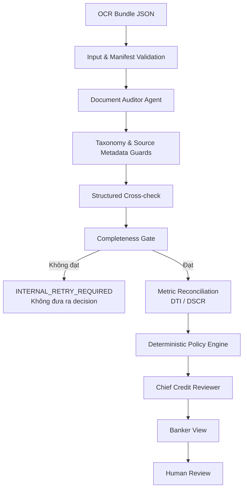

<div align="center">

# Credit Assessment Agent

### Microservice rà soát hồ sơ tín dụng có dẫn chứng đến từng file và từng trang


**Không chỉ trả về một kết luận. Hệ thống chỉ rõ lỗi gì, nằm ở đâu, vì sao là lỗi, ảnh hưởng thế nào và chuyên viên cần làm gì tiếp theo.**

</div>

---

## Bài toán được giải quyết

Microservice nhận một **OCR Bundle JSON** của hồ sơ tín dụng, đọc hết manifest và toàn bộ trang, sau đó trả về báo cáo có cấu trúc dành cho chuyên viên ngân hàng.

Mỗi finding trong đầu ra nghiệp vụ gồm:

| Trường | Ý nghĩa |
|---|---|
| `source_file` | Tên tài liệu gốc cần mở |
| `source_page` | Trang chính xác chứa bằng chứng |
| `source_excerpt` | Trích đoạn dùng để kiểm chứng |
| `issue_type` / `severity` | Loại lỗi và mức độ nghiêm trọng |
| `why_it_is_an_issue` | Vì sao thông tin này sai, thiếu hoặc mâu thuẫn |
| `decision_effect` | Ảnh hưởng tới khuyến nghị tín dụng |
| `required_action` | Việc chuyên viên hoặc khách hàng cần làm tiếp |
| `grounding_status` | Mức độ bằng chứng đã được xác minh từ tài liệu |

Hệ thống **không tự phê duyệt, không giải ngân và không thay thế người có thẩm quyền**.

## Điểm nổi bật

- Quét đầy đủ bốn lớp: **Hard Stop, CIC, Financial Logic và Cross-check**.
- Không dừng sau lỗi đầu tiên; mọi trang trong manifest đều phải được rà soát.
- `Completeness Gate` thuần code chặn kết quả khi thiếu trang, trang không đọc được hoặc agent chưa hoàn tất đủ bốn lớp.
- DTI được đối soát lại từ đúng toán hạng trên cùng nguồn; DSCR và policy threshold do code xác định xử lý.
- Đối chiếu có cấu trúc giữa căn cước, ngày sinh, đăng ký doanh nghiệp và các mốc pháp lý.
- Chuẩn hóa taxonomy để loại false positive từ marker của bộ dữ liệu hoặc diễn giải không có bằng chứng.
- `Chief Credit Reviewer` chỉ tổng hợp; không thể hạ mức `REJECT`, đổi candidate hoặc xóa issue đã được guard xác nhận.
- Khi LLM lỗi, reviewer có fallback xác định và pipeline vẫn giữ nguyên decision cùng toàn bộ bằng chứng đã kiểm chứng.
- Cache theo case, manifest, prompt version và policy version bằng idempotency key.

## Kiến trúc



Hai bất biến được thực thi ngoài prompt:

1. `expected_pages == reviewed_pages`, đủ page ledger, đủ document và đủ bốn lớp trước khi Policy Engine chạy.
2. Policy Engine sở hữu decision candidate; LLM chỉ diễn giải facts đã qua validation.

## Cài đặt nhanh

Yêu cầu Python 3.11 trở lên.

```powershell
git clone --branch duccuong https://github.com/caochihai/duskdash.git
cd duskdash\credit-assessment-agent

python -m venv .venv
.\.venv\Scripts\Activate.ps1
python -m pip install -e ".[dev]"
Copy-Item .env.example .env
```

Điền khóa vào `.env`. File này đã được ignore và không được commit.

### Chạy offline với fixture xác định

```powershell
$env:LLM_MODE = "deterministic"
python -m uvicorn app.main:app --host 127.0.0.1 --port 8000
```

### Chạy với GLM-5.2

```dotenv
LLM_MODE=glm
GLM_API_KEY=<your-key>
GLM_MODEL=GLM-5.2
GLM_BASE_URL=https://mkp-api.fptcloud.com
```

```powershell
python -m uvicorn app.main:app --host 0.0.0.0 --port 8000
```

Swagger UI: <http://127.0.0.1:8000/docs>

> `deterministic` chỉ chạy với fixture nội bộ có `_fixture_verified=true`. Dữ liệu OCR thật không có cờ này sẽ bị chặn an toàn nếu chưa cấu hình LLM.

## API

### `POST /v1/assess`

Nhận OCR Bundle và xử lý đồng bộ. Response chứa `job_id`, `idempotency_key`, `cached` và `report`.

```powershell
Invoke-RestMethod `
  -Method Post `
  -Uri http://127.0.0.1:8000/v1/assess `
  -ContentType "application/json" `
  -InFile .\tests\fixtures\multi_issue_bundle.json
```

### `GET /v1/assess/{job_id}`

Đọc lại report đã lưu trong process. Bản hiện tại dùng cache in-memory.

### `GET /health`

```json
{"status":"ok","service":"credit-assessment-agent"}
```

Input sai schema, thiếu field hoặc manifest không nhất quán trả HTTP 422; service không tự đoán dữ liệu còn thiếu.

## Chạy một hồ sơ mẫu

```powershell
python scripts\run_fixture.py `
  tests\fixtures\multi_issue_bundle.json `
  artifacts\examples\multi-issue-response.json
```

Fixture nhiều lỗi phải trả `processing_status=COMPLETE`, `decision=REJECT` và đủ `ISS-001` đến `ISS-005`; Hard Stop ở trang đầu không làm bỏ qua các trang sau.

## Kiểm chứng với bộ hồ sơ PDF/ảnh cục bộ

Cài OCR extra:

```powershell
python -m pip install -e ".[ocr]"
```

Tạo một OCR Bundle:

```powershell
python scripts\build_ocr_bundle.py `
  "D:\du-lieu\ho-so-01" `
  "artifacts\ocr\ho-so-01.json" `
  --easyocr
```

Tạo bundle cho toàn bộ thư mục con và đưa qua GLM:

```powershell
python scripts\build_all_ocr_bundles.py `
  "D:\du-lieu\ho-so-doanh-nghiep" `
  "artifacts\ocr"

python scripts\run_live_assessments.py `
  "artifacts\ocr" `
  "artifacts\assessments"

python scripts\build_grounded_batch_reports.py `
  "artifacts\assessments" `
  "artifacts\banker-reports"
```

`artifacts/` và `reports/` bị loại khỏi Git vì có thể chứa thông tin khách hàng, OCR text và đánh giá tín dụng.

## Decision matrix mặc định

| Điều kiện | Candidate |
|---|---|
| Hard Stop critical | `REJECT` |
| CIC nhóm 3–5 hoặc CIC critical | `REJECT` |
| DTI > 50%, DSCR < 1,0 hoặc Financial Logic critical | `REJECT` |
| Cross-check high/critical chưa xử lý hoặc criterion `UNKNOWN` | `PENDING` |
| DTI 40–50% hoặc DSCR 1,0–1,25 | `APPROVE_WITH_CONDITIONS` |
| Tất cả criterion bắt buộc pass/not applicable | `APPROVE` |
| Còn lại | `PENDING` |

Các ngưỡng nằm trong `app/engine/policy_engine.py`; phải thay bằng policy đã được ngân hàng phê duyệt và version hóa trước khi production.

## Kiểm thử

```powershell
python -m pytest -q
```

Bộ test bao phủ API, end-to-end, completeness gate, document auditor, GLM adapter, policy engine, decision safety guard và banker-facing output.

## Cấu trúc repository

```text
credit-assessment-agent/
├── app/
│   ├── agents/          # Document Auditor và Chief Reviewer
│   ├── api/v1/          # assess, polling, health
│   ├── engine/          # gate, metric, taxonomy, cross-check, policy
│   ├── llm_client/      # GLM và Anthropic structured adapters
│   ├── observability/   # JSON event log
│   ├── orchestration/   # pipeline và idempotency cache
│   ├── reporting/       # banker view có file/trang/lý do/hành động
│   └── schemas/         # input, auditor và output contracts
├── scripts/             # OCR, live run, benchmark, render reports
├── tests/               # unit, integration, API và E2E
├── .env.example
└── pyproject.toml
```

## An toàn dữ liệu

- Không commit `.env`, API key, PDF/ảnh hồ sơ, OCR Bundle hay assessment thực tế.
- Log và artifact production cần mã hóa, kiểm soát truy cập và chính sách lưu giữ dữ liệu cá nhân.
- Mọi finding nghiêm trọng chưa `VERIFIED` phải được chuyên viên mở đúng file/trang để xác minh.
- Decision chỉ là khuyến nghị; bước phê duyệt cuối cùng luôn là human-in-the-loop.

## Việc cần làm trước production

- Thay cache in-memory bằng Redis hoặc database dùng chung giữa replica.
- Đưa xử lý hồ sơ dài sang worker/queue và giữ contract polling.
- Bổ sung authentication, authorization, rate limit, vault, encryption và immutable audit sink.
- Tích hợp checklist hồ sơ bắt buộc cùng policy version chính thức của ngân hàng.
- Đánh giá bằng golden set do chuyên viên tín dụng gắn nhãn, tập trung vào issue recall và source grounding.
- Tách OCR helper khỏi runtime; production chỉ nhận OCR Bundle từ Document Intake/OCR service đã được kiểm soát.

---

<div align="center">

**Evidence first · Deterministic policy · Human decision**

</div>
