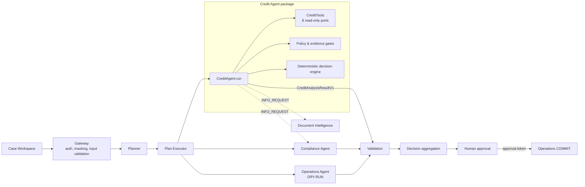
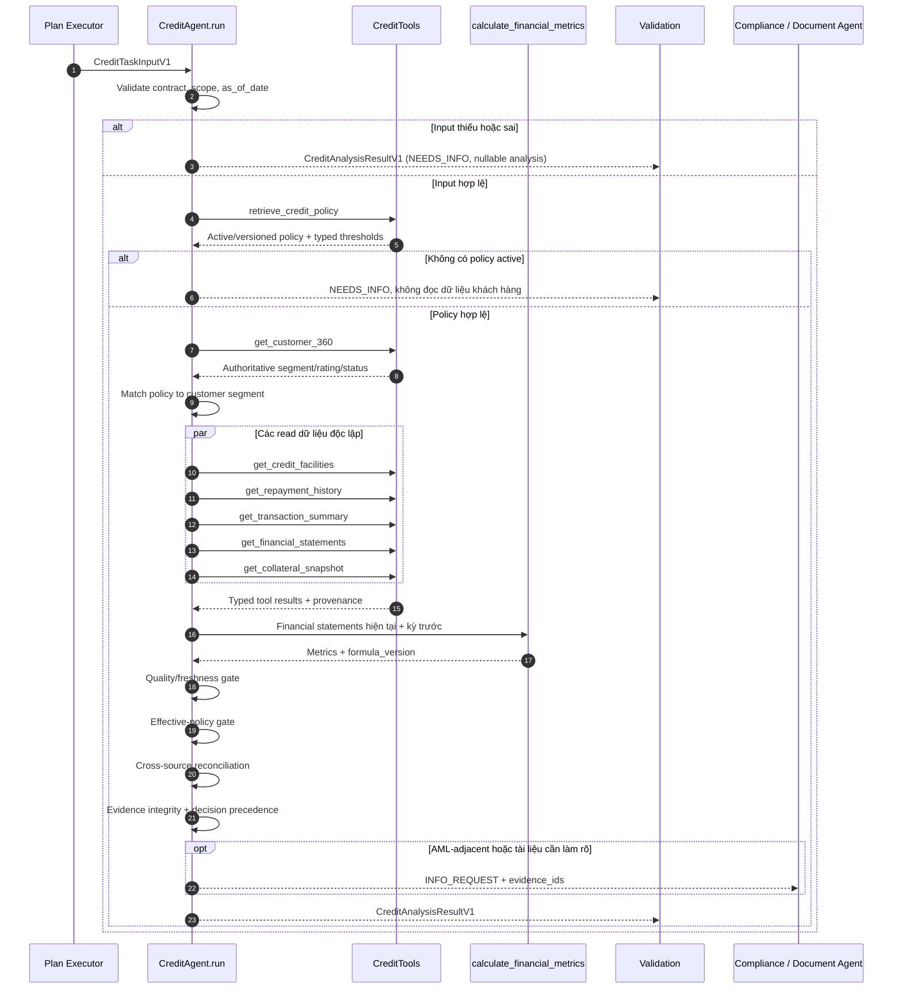

# Credit Agent: kiến trúc, contract và hướng dẫn tích hợp

## 1. Vai trò trong ExpertFlow

`CreditAgent` là một specialist executor cho hai loại việc:

- `CREDIT_RENEWAL_REVIEW`: rà soát gia hạn tín dụng SME.
- `CREDIT_LIMIT_REVIEW`: đánh giá lại hạn mức SME.

Agent nhận một task đã được Planner/Plan Executor tạo, đọc dữ liệu có kiểm soát, tính chỉ số qua calculator xác định, đối chiếu nguồn, áp dụng chính sách có phiên bản và trả `CreditAnalysisResultV1` cho Validation. Agent **không phải** Supervisor, Planner, Validation, Compliance, Document Intelligence, Operations, dashboard hay cơ chế human approval của lời giải hackathon đầy đủ.



Luồng nét đứt là yêu cầu thông tin có cấu trúc, không phải quyền gọi một hành động ghi thay agent khác. Kết quả Credit Agent đi tới Validation, không đi thẳng tới khách hàng hoặc Operations COMMIT.

## 2. Ranh giới nghiệp vụ

Trong phạm vi:

- quan hệ khách hàng và tổng dư nợ;
- facility, hạn mức hiện tại, dư nợ và mức sử dụng;
- lịch sử trả nợ;
- dòng tiền/tập trung đối tác ở mức tổng hợp;
- báo cáo tài chính hiện tại so với kỳ trước;
- chỉ số tài chính do calculator trả về;
- mức đủ về mặt tài chính của tài sản bảo đảm, không đánh giá hiệu lực pháp lý;
- policy matching và khuyến nghị có evidence.

Ngoài phạm vi:

- KYC, UBO, AML, sanctions và kết luận gian lận/pháp lý: chuyển Compliance;
- OCR hoặc đọc tài liệu thô: chuyển Document Intelligence;
- phê duyệt cuối, SLA và routing theo thẩm quyền: Supervisor/human approval;
- booking, thay đổi hạn mức, giải ngân hoặc bất kỳ system write nào: Operations sau phê duyệt.

`recommended_limit` và `recommended_tenor_months` chỉ là đề xuất. `human_approval_required` luôn là `true`.

## 3. Các thành phần public

| Thành phần | Trách nhiệm |
|---|---|
| `CreditAgent.run` | Điểm chạy bất đồng bộ cho đúng một task; luôn trả một output contract thống nhất. |
| `CreditTaskInputV1` | Input đã định kiểu, khóa `as_of_date`, request và scope truy cập. |
| `CreditAnalysisResultV1` | Kết quả có trạng thái, recommendation, analysis, evidence, policy citation, data quality và next actions. |
| `CreditTools` | Port read-only gồm đúng 8 thao tác dữ liệu/calculator/policy; adapter thật do hệ thống tích hợp cung cấp. |

Thiết kế framework-neutral giúp cùng một core được gọi trực tiếp, bọc bằng FastAPI hoặc đặt trong node LangGraph mà không nhúng logic tín dụng vào transport/orchestrator.

## 4. Input contract

Một `CreditTaskInputV1` tối thiểu cần có:

- `task_id`, `case_id`, `task_type`, `customer_id`;
- `credit_request`: `request_type`, `product_code`, `current_limit`, `requested_limit`, `requested_tenor_months`, `currency`, `purpose`, `collateral_required`;
- `as_of_date` dùng làm cut-off chung cho mọi tool;
- `permissions.allowed_scopes` để adapter/orchestrator chặn truy cập ngoài quyền.

Không suy đoán amount, tenor, purpose hoặc ngày cut-off bị thiếu. Input sai contract phải dừng trước khi gọi tool. Với task không thuộc renewal/limit review, caller nên route sang agent thích hợp.

Ví dụ rút gọn:

```json
{
  "task_id": "task-001",
  "case_id": "case-001",
  "task_type": "CREDIT_RENEWAL_REVIEW",
  "customer_id": "customer-ref-001",
  "credit_request": {
    "request_type": "RENEWAL",
    "product_code": "SME_WC",
    "current_limit": "1000000000",
    "requested_limit": "1000000000",
    "requested_tenor_months": 12,
    "currency": "VND",
    "purpose": "Working capital renewal",
    "collateral_required": true
  },
  "as_of_date": "2026-07-18",
  "permissions": {
    "allowed_scopes": [
      "customer:read", "credit:read", "transactions:read",
      "financials:read", "collateral:read", "policy:read"
    ]
  }
}
```

Core tham chiếu catalog mặc định: `customer:read` cho Customer 360; `credit:read` cho facility/repayment; `transactions:read`; `financials:read` cho statement/calculator; `collateral:read`; và `policy:read`. Case tín chấp không yêu cầu `collateral:read` và không gọi collateral tool. Deployment có catalog khác nên map scope tại gateway/adapter nhưng vẫn phải chặn trước I/O.

Trong JSON, nên gửi và sẽ luôn nhận lại mọi giá trị `Decimal` dưới dạng chuỗi thập phân, ví dụ `"1000000000"` hoặc `"1.25"`. Đây là wire contract có chủ ý để bảo toàn số tiền/tỷ lệ chính xác; consumer không nên ép qua IEEE-754 `float`. Python API vẫn dùng `Decimal` trong model.

## 5. `CreditTools`: đúng 8 read tools

| Tool | Dữ liệu/ý nghĩa |
|---|---|
| `get_customer_360` | Quan hệ, phân khúc/rating, exposure và số dư tiền gửi tổng hợp. |
| `get_credit_facilities` | Facility hiện tại, approved limit, outstanding và utilization. |
| `get_repayment_history` | On-time/late count, DPD và trạng thái cơ cấu trong lookback window. |
| `get_transaction_summary` | Inflow/outflow theo tháng, volatility và concentration ở mức tổng hợp. |
| `get_financial_statements` | Dữ liệu báo cáo tài chính thô cho kỳ hiện tại/kỳ trước. |
| `calculate_financial_metrics` | Calculator xác định cho margin, liquidity, leverage, DSCR, coverage, working capital… kèm `formula_version`. |
| `get_collateral_snapshot` | Eligible/appraised value, collateral IDs, valuation date/status, coverage basis và denominator. Ratio phải tự đối chiếu được từ eligible value/denominator. |
| `retrieve_credit_policy` | Policy/clause/threshold có document ID, version, status và thời gian hiệu lực. |

Core không có SQL và không tự tạo tool thứ chín. Adapter phải phân biệt `NO_DATA`/partial với `ERROR`/timeout; dữ liệu không có không đồng nghĩa với “không có rủi ro”. Các số tiền phải giữ currency/unit và source reference. Mọi ratio được báo cáo phải là output của `calculate_financial_metrics`, không tính bằng LLM hoặc prose.

## 6. Pipeline bất đồng bộ nhưng xác định



“Bất đồng bộ” nghĩa là các I/O độc lập có thể chạy đồng thời để giảm latency. “Xác định” nghĩa là dependency, gate, thứ tự ưu tiên trạng thái và cách dựng output nằm trong code; kết quả không phụ thuộc thứ tự tool trả về. Calculator chỉ chạy sau khi có financial statements. Mọi truy vấn dùng cùng `as_of_date`, và output chỉ được phát sau khi toàn bộ kết quả được chuẩn hóa.

Implementation hiện tại lấy policy trước, dừng ngay nếu không có phiên bản active, sau đó chỉ đọc Customer 360 để khớp phân khúc. Nếu khớp, facility/repayment/transaction/financial/collateral mới chạy song song. Vì port dữ liệu chỉ nhận task/cut-off, adapter phải trả coverage đủ rộng và khai báo coverage thực tế để gate so với threshold policy. Nếu hệ thống đích cần truyền lookback vào data API, có thể mở rộng query context của adapter mà không thay đổi quyết định downstream.

## 7. Quality gate, policy gate và evidence gate

### Quality/freshness gate

Gate kiểm tra tối thiểu financial statements hiện tại và kỳ trước, coverage của transaction/repayment, ledger theo cut-off, collateral khi áp dụng, dữ liệu partial/stale và xung đột nguồn.

- Thiếu dữ liệu bắt buộc hoặc metric không tính được: không được phát recommendation dương.
- Tool bắt buộc lỗi/timeout/forbidden: `SYSTEM_EXCEPTION`, không chuyển thành “không thấy rủi ro”.
- Xung đột material không thể reconcile: giữ evidence của cả hai nguồn và chuyển `MANUAL_REVIEW`, không tự chọn một bên.
- Dữ liệu stale/partial phải xuất hiện trong data quality, condition hoặc missing information; không silent pass.

### Effective-policy gate

Policy được chọn theo task/product/segment/topic và `as_of_date`. Citation cần `document_id`, `version`, `section`, `effective_from`, `effective_to` nếu có, và trạng thái hiệu lực; các metadata này không được rỗng. Policy contract còn phải khai rõ tập phân khúc, internal rating, relationship status, collateral valuation status và collateral coverage basis được phép (`*` chỉ khi policy thực sự là wildcard). Giá trị nguồn nằm ngoài tập cho phép phải có treatment tường minh qua risk-code mapping; nếu không, agent dừng để bổ sung policy thay vì silent pass.

Mọi threshold như lookback, staleness, ratio cutoff hoặc authority limit phải đến từ `retrieve_credit_policy`, không hard-code trong rule engine hoặc tài liệu này. Không tìm được policy active phù hợp là hard stop đối với recommendation dương.

### Evidence gate

Mỗi material claim và risk flag mang `evidence_ids`. Mỗi ID phải trỏ tới một evidence item có `source_system`, `source_reference`, `as_of_date`, `tool_run_id` và fact ngắn gọn. Policy claim liên kết tới policy citation tương ứng. Gate từ chối dangling IDs, evidence trùng ID hoặc claim policy thiếu phiên bản/hiệu lực.

Evidence là trace có thể kiểm tra, không phải chain-of-thought. Output chỉ ghi fact, rationale ngắn và nguồn cần thiết.

## 8. Thứ tự ưu tiên quyết định

Rule engine áp dụng các trạng thái theo thứ tự ưu tiên, để hai tool hoàn thành khác thứ tự vẫn cho cùng verdict:

1. `SYSTEM_EXCEPTION`: một dependency bắt buộc lỗi hoặc pipeline không thể đánh giá.
2. `NEEDS_INFO`: input/dataset bắt buộc thiếu, coverage không đủ hoặc metric bắt buộc không computable.
3. `MANUAL_REVIEW`: dữ liệu material xung đột, extraction confidence thấp hoặc pattern ngoài năng lực agent.
4. `NOT_RECOMMENDED`: dữ liệu đầy đủ và nhất quán nhưng evidence/policy không hỗ trợ request.
5. `PASS_WITH_CONDITIONS`: có cơ sở chuyển review, chỉ còn các điều kiện được nêu rõ và không thuộc blocker loại trên.
6. `READY_FOR_APPROVAL_REVIEW`: đủ evidence, policy hợp lệ, không blocker/condition material.

Mapping status:

| Decision | `status` |
|---|---|
| `READY_FOR_APPROVAL_REVIEW` | `COMPLETED` |
| `PASS_WITH_CONDITIONS` | `COMPLETED` |
| `MANUAL_REVIEW` | `COMPLETED` |
| `NOT_RECOMMENDED` | `COMPLETED` |
| `NEEDS_INFO` | `NEEDS_INFO` |
| `SYSTEM_EXCEPTION` | `SYSTEM_EXCEPTION` |

`READY_FOR_APPROVAL_REVIEW` không được có blocking condition, missing information hoặc blocking question. `PASS_WITH_CONDITIONS` phải có ít nhất một condition cụ thể. `NOT_RECOMMENDED` chỉ dùng khi có đủ evidence, không dùng để che một data gap. Limit/tenor phải `null` trên đường dừng sớm khi chưa đủ cơ sở sizing.

Reference MVP không có tool sizing hạn mức độc lập, nên chỉ echo `requested_limit` và `requested_tenor_months` từ input khi decision là READY/PASS; nó không tự giảm hay tạo một con số mới. Nếu dự án cần risk-based sizing, hãy thêm output sizing có `formula_version`, input references và policy citation vào deterministic calculator contract, rồi kiểm tra độc lập ở Validation.

## 9. Các chỉnh sửa contract so với prompt tham chiếu

System prompt ban đầu có một số yêu cầu đúng về mặt nghiệp vụ nhưng schema minh họa chưa biểu diễn được mọi đường chạy. Implementation dùng một contract chặt hơn:

1. **Một output schema cho cả early return.** Thay object rút gọn `{status, missing_fields}`, `CreditAgent.run` luôn trả `CreditAnalysisResultV1`. Các analysis block/number chưa có ở đường `NEEDS_INFO` hoặc `SYSTEM_EXCEPTION` được phép `null`; không tạo số giả để thỏa schema.
2. **Evidence linkage tường minh.** Summary, assessment/risk material và info request dùng `evidence_ids`; evidence collection là nguồn resolve ID duy nhất. Điều này khép khoảng trống “claim phải có evidence” nhưng summary cũ không có chỗ ghi ID.
3. **Policy citation có hiệu lực.** Citation bổ sung dữ liệu `effective_from`, `effective_to`/status để code kiểm tra policy effective tại `as_of_date`, thay vì chỉ ghi document/version/section.
4. **Info request là dữ liệu hạng nhất.** Output có cấu trúc `INFO_REQUEST` với `target_agent`, `reason` và `evidence_ids`, nên việc chuyển Compliance/Document Intelligence có thể được Plan Executor định tuyến và audit. Đây không phải tool call ghi hoặc kết luận thay agent đích.
5. **Lỗi và data gap không nhập nhằng.** Tool failure dẫn tới `SYSTEM_EXCEPTION`; `NO_DATA`/thiếu hồ sơ dẫn tới `NEEDS_INFO`; conflict có dữ liệu dẫn tới `MANUAL_REVIEW`.
6. **Invariant theo verdict.** Schema/rule gate giữ `human_approval_required = true`, giới hạn tối đa năm follow-up questions và ngăn các tổ hợp như READY còn blocker hoặc SYSTEM_EXCEPTION vẫn có recommended limit.

Các thay đổi này giữ ý định của prompt nhưng làm output validate được, audit được và an toàn cho orchestration downstream.

JSON Schema trong `schemas/` phục vụ đăng ký shape/wire format và có một số conditional chuẩn cho status/decision. Những invariant liên tập hợp như evidence ID/claim ID phải resolve, policy có hiệu lực và READY không còn blocker được Pydantic/core validator thực thi; consumer không được coi JSON Schema đơn lẻ là validation nghiệp vụ đầy đủ. Danh sách này cũng được gắn trong `x-credit-agent-runtime-invariants` của schema xuất ra.

## 10. Follow-up và `INFO_REQUEST`

Follow-up question hướng tới chuyên viên/hồ sơ, tối đa năm câu và được ưu tiên theo mức blocking:

```json
{
  "question": "Receivables tăng nhưng inflow giảm; cung cấp aging schedule tại ngày cut-off.",
  "why_it_matters": "Cần reconcile doanh thu và khả năng chuyển đổi tiền mặt.",
  "expected_evidence": ["receivables_aging", "largest_debtor_summary"],
  "blocking_if_unanswered": true,
  "evidence_ids": ["ev-fin-01", "ev-txn-01"]
}
```

`INFO_REQUEST` dùng cho giao tiếp agent-to-agent:

```json
{
  "message_type": "INFO_REQUEST",
  "target_agent": "compliance_agent",
  "reason": "Cần Compliance đánh giá related-party flow; Credit Agent không đưa kết luận AML.",
  "evidence_ids": ["ev-txn-02"]
}
```

Caller/orchestrator quyết định gửi message và quản lý vòng re-plan/challenge. Một lần chạy lại nên có `run_id` mới, vẫn giữ `task_id`/`case_id` và audit lý do thay đổi; không sửa âm thầm verdict của lần chạy trước.

## 11. Tích hợp trực tiếp

Implement `CreditTools` bằng adapter của hệ thống đích rồi inject vào agent:

```python
from credit_agent import AgentConfig, CreditAgent, CreditTaskInputV1

tools = ProductionCreditTools(
    customer_client=customer_client,
    loan_client=loan_client,
    policy_client=policy_client,
    calculator=calculator,
)

agent = CreditAgent(
    tools=tools,
    audit_sink=durable_audit_sink,
    config=AgentConfig(require_audit_sink=True),
)
result = await agent.run(CreditTaskInputV1.model_validate(payload))
await validation_client.submit(result.model_dump(mode="json"))
```

Không chuyển thẳng result sang một write API. Validation và human approval vẫn là boundary bắt buộc của workflow tổng thể.

## 12. Tích hợp FastAPI

API wrapper dự kiến cung cấp:

- `POST /v1/credit-analysis` nhận `CreditTaskInputV1` và trả `CreditAnalysisResultV1`;
- `GET /agent-card` để Planner registry đọc capability/task/tool whitelist;
- `GET /health` kiểm tra tiến trình.

Module `credit_agent.api:app` mặc định fail-closed (`/health` và analysis trả `503`) nếu chưa cấu hình. Chỉ bật fixture demo tường minh khi phát triển local bằng PowerShell:

```powershell
$env:CREDIT_AGENT_DEMO_MODE = "1"
uvicorn credit_agent.api:app --reload
```

Ở production, tạo `CreditAgent` một lần trong application lifespan, inject adapter thật và audit sink append-only có `durable = True`, rồi tạo app bằng `create_app(agent, scope_resolver=scopes_from_authenticated_request, task_authorizer=principal_can_access_task)`. `scope_resolver` lấy coarse scopes từ principal/session đã được gateway xác thực; `task_authorizer` bắt buộc kiểm tra record/tenant-level rằng principal được đọc đúng `case_id` và `customer_id`. Wrapper thay thế scope do request body tự khai, nên client không thể tự cấp quyền đọc hoặc đổi ID để đọc chéo hồ sơ. Hai callback này có ngân sách mặc định 2 giây (`authorization_timeout_seconds`, tối đa 5 giây); timeout hoặc exception trả `503` đã làm sạch trước khi gọi tool. Callback synchronous chạy ngoài event loop và phải read-only vì timeout không thể hủy thread đã bắt đầu. Mọi response có header `X-Credit-Agent-Mode` (`demo`, `injected` hoặc `unconfigured`). `AgentConfig(require_audit_sink=True, fail_on_audit_error=True)` là bắt buộc, config bị đóng băng sau khởi tạo, và production wrapper từ chối `allow_placeholder_policy=True`. Cờ capability không tự chứng minh độ bền; deployment vẫn phải kiểm thử append-only/delivery thực tế. Không nhận `CreditTools`, credential hoặc quyền có thẩm quyền từ request body.

Validation error HTTP được làm sạch để không echo input nhạy cảm. Quy ước HTTP error chỉ dành cho lỗi transport/contract/cấu hình; kết quả nghiệp vụ như `NEEDS_INFO` vẫn được biểu diễn bằng `CreditAnalysisResultV1`.

OpenAPI dùng cùng decision/status/Decimal conditionals với schema standalone và công bố `x-credit-agent-runtime-invariants`. Package không đoán OAuth/JWT/mTLS của hệ thống đích: `x-authentication-boundary` đánh dấu AuthN do host gateway cung cấp; deployment phải gắn security scheme thật thay vì coi callback là cơ chế đăng nhập.

## 13. Adapter LangGraph

Credit Agent nên là một node hẹp giữa Plan Executor và Validation:

```python
from typing import Any

async def credit_node(state: dict[str, Any]) -> dict[str, Any]:
    task = CreditTaskInputV1.model_validate(state["credit_task"])
    result = await credit_agent.run(task)
    return {"credit_analysis": result.model_dump(mode="json")}
```

Graph routing đọc `result.status`, `recommendation.decision` và `info_requests`:

- mọi output trước hết tới Validation;
- `info_requests` có thể tạo task cho Compliance/Document Intelligence;
- `NEEDS_INFO` quay về luồng bổ sung hồ sơ/re-plan có giới hạn vòng;
- `SYSTEM_EXCEPTION` đi error handling/ops support, không được route như một approval candidate;
- agent không tạo edge trực tiếp tới Operations COMMIT.

LangGraph state/checkpoint không thay thế audit trail của source system. Giữ payload typed, không nhét raw document/transaction-level PII vào graph state.

## 14. Bảo vệ dữ liệu

Các baseline cần giữ khi tích hợp:

- dữ liệu nhận vào đã được gateway tối thiểu hóa/masking; Credit Agent không xin thêm định danh không cần thiết;
- dùng opaque customer/account/document reference, không ghi raw account number hoặc transaction-level PII vào result/log/trace;
- adapter enforce `allowed_scopes` trước khi gọi nguồn và chỉ dùng record không vượt `as_of_date`;
- log fact/evidence cần thiết, không log credential, payload thô hoặc chain-of-thought;
- mã hóa in transit/at rest, retention/deletion, access review và audit export theo policy/pháp chế hiện hành của tổ chức triển khai;
- fixture demo phải là dữ liệu giả lập và được gắn nhãn rõ.

Tài liệu này không khẳng định một văn bản pháp lý hoặc ngưỡng policy cụ thể là sự thật production. Đội triển khai phải xác nhận yêu cầu pháp lý hiện hành và cấu hình chúng ngoài core agent.

## 15. Checklist adapter production

### Contract và quyền truy cập

- [ ] Implement đủ đúng 8 method của `CreditTools`; không expose write/SQL escape hatch.
- [ ] Enforce authN/authZ và mapping `allowed_scopes` ở server side.
- [ ] Không tin `permissions.allowed_scopes` từ body; dùng `scope_resolver` server-side và kiểm thử chống self-grant.
- [ ] Implement `task_authorizer` để ràng buộc principal/tenant với đúng case/customer; kiểm thử IDOR/cross-tenant trước bất kỳ tool call nào.
- [ ] Tất cả call nhận/khóa cùng `case_id`, `task_id`, `customer_id`, `as_of_date` và correlation ID.
- [ ] Phân biệt `OK`, `PARTIAL`, `NO_DATA`, `ERROR`, `TIMEOUT`, `FORBIDDEN`.
- [ ] Mỗi response có `tool_run_id`, source system/reference, coverage/as-of/retrieved time và warning/error an toàn.
- [ ] Timeout, retry và circuit breaker chỉ áp dụng cho read operation transient; retry không được đổi cut-off hay che lỗi.

### Dữ liệu và tính toán

- [ ] Monetary value luôn có currency/unit; không tự FX nếu thiếu nguồn tỷ giá có thẩm quyền.
- [ ] Financial statements có kỳ hiện tại/kỳ trước, statement ID, loại/audit status và provenance.
- [ ] Calculator là deterministic/versioned; mỗi metric có unit, formula, input references, prior/current và trả missing inputs rõ ràng.
- [x] Facility list phải có record khớp `credit_request.product_code`; aggregate limit/outstanding/utilization/currency được đối chiếu với tổng record khớp.
- [x] Collateral yêu cầu collateral ID, coverage denominator/basis được policy cho phép và coverage ratio được đối chiếu với eligible value/denominator.
- [ ] Transaction/repayment trả coverage thực tế để freshness gate kiểm tra.
- [ ] Collateral là conditional cho case tín chấp theo policy/task, nhưng không được silent-skip khi bắt buộc.
- [ ] Policy adapter lọc theo `as_of_date`, trả version/effective range/status/typed threshold (rating freshness, late-event, cash volatility/coverage...), yêu cầu audited/unaudited, tập category được phép và đánh dấu fixture/non-production.

### Evidence, bảo mật và tích hợp

- [ ] Sinh evidence ID ổn định trong một run, không trùng và không dangling.
- [ ] Redact/mask account number, transaction PII, secret và payload nhạy cảm khỏi log/error.
- [ ] Audit tool name, timing, outcome, policy version, formula version và decision; không lưu chain-of-thought.
- [ ] Cấu hình append-only audit sink, `require_audit_sink=True`, timeout/failure policy và kiểm thử sink treo/lỗi.
- [ ] FastAPI/LangGraph wrapper không bỏ qua output validation hoặc human-approval boundary.
- [ ] Contract test bao phủ cả sáu decision, failure của từng mandatory tool, policy boundary và source conflict.
- [ ] Test prompt/data injection để chứng minh không gọi tool ngoài whitelist, SQL hoặc write action.

## 16. Checklist vận hành

- [ ] Theo dõi latency toàn run/từng tool, timeout/error/no-data rate, decision distribution và evidence-gate failure.
- [ ] Cảnh báo khi policy không active, formula version đổi, source freshness giảm hoặc data conflict tăng bất thường.
- [ ] Dashboard hiển thị `case_id`, `task_id`, `run_id`, task status và evidence/policy trace đã redaction.
- [ ] Có runbook cho dependency outage, invalid policy, schema drift, calculator mismatch và manual review queue.
- [ ] Version Agent Card, input/output schema, policy và calculator độc lập; thay đổi có migration/compatibility test.
- [ ] Re-run tạo run mới và giữ lineage; không overwrite kết quả/audit cũ.
- [ ] Giới hạn tool-call, execution deadline và tối đa năm follow-up questions được đo/kiểm thử.
- [ ] Định kỳ review quyền, retention, dữ liệu demo và các giả định production với Credit Risk, Compliance, Security và Legal.

## 17. Agent Card tối thiểu

Registry có thể công bố card tương đương:

```json
{
  "agent_id": "credit_agent",
  "name": "SME Credit Renewal Agent",
  "version": "1.0.0",
  "supported_tasks": ["CREDIT_RENEWAL_REVIEW", "CREDIT_LIMIT_REVIEW"],
  "input_schema": "CreditTaskInputV1",
  "output_schema": "CreditAnalysisResultV1",
  "allowed_tools": [
    "get_customer_360",
    "get_credit_facilities",
    "get_repayment_history",
    "get_transaction_summary",
    "get_financial_statements",
    "calculate_financial_metrics",
    "get_collateral_snapshot",
    "retrieve_credit_policy"
  ],
  "forbidden_actions": [
    "APPROVE_CREDIT",
    "COMMIT_CREDIT_CHANGE",
    "MODIFY_CUSTOMER_DATA",
    "EXECUTE_PAYMENT"
  ],
  "human_approval_required": true
}
```

Agent Card là metadata cho Planner/registry, không phải bằng chứng một dependency đang khỏe và không cấp thêm quyền cho agent.

## 18. Giới hạn của MVP

- Adapter demo/fixture không phải nguồn dữ liệu hoặc policy production.
- Package này không cung cấp toàn bộ Planner, Validation, Compliance, Document Intelligence, Operations, dashboard hay approval-token flow trong `workflow.md`.
- Agent không chứng minh tính đúng pháp lý của tài sản bảo đảm và không đưa kết luận AML/fraud.
- Chất lượng recommendation phụ thuộc vào coverage, freshness, provenance của adapter và policy/calculator được inject.
- System prompt gốc được lưu tại [REFERENCE_SYSTEM_PROMPT.md](REFERENCE_SYSTEM_PROMPT.md); production không nên dùng prompt-only enforcement thay cho các guardrail/schema trong code.
- Trước khi dùng thật, phải hoàn tất model validation, security review, policy validation, model/rule risk review, UAT và human-approval integration theo quy trình nội bộ.
