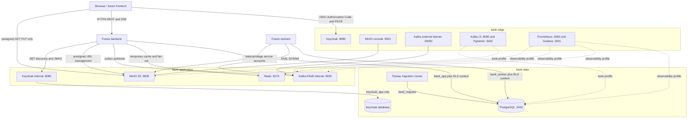
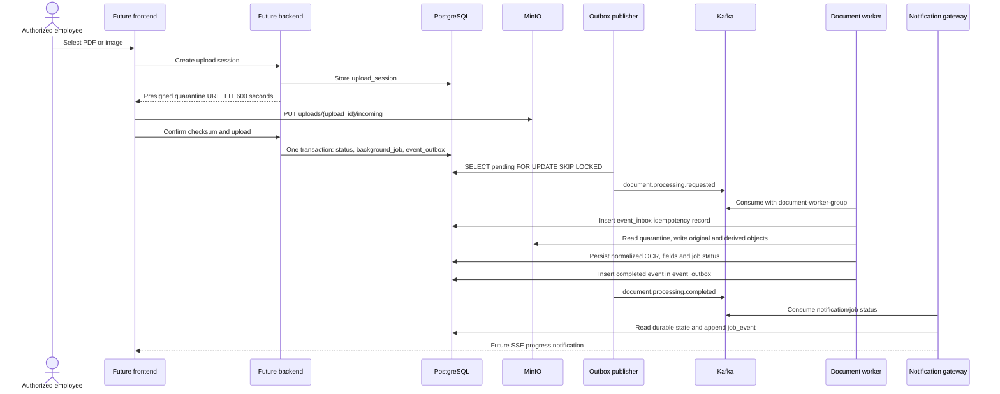
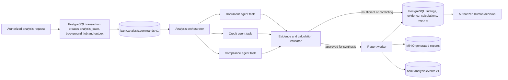
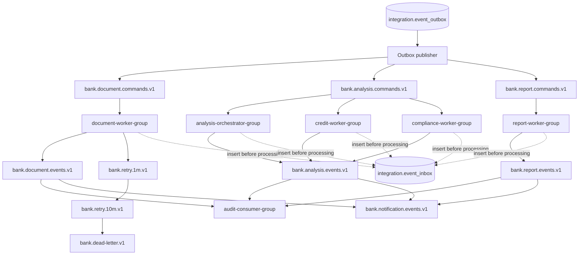
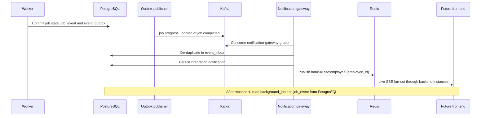

# Infrastructure architecture

This repository provisions only the local infrastructure for the AI Credit
Intelligence Workbench. Frontend, backend and worker boxes below are future
consumers shown to define trust boundaries and connection contracts; they are
not implemented by this infrastructure package. PostgreSQL is the business
source of truth. Kafka carries durable asynchronous events, MinIO stores binary
objects, and Redis stores only temporary coordination/cache data.

## Topology

PostgreSQL is never attached to `bank-edge`. The local host mappings for
PostgreSQL and Redis are developer conveniences and must not be copied into a
production deployment. Tools and observability services are opt-in profiles.

## Document pipeline

Large OCR text, files and images stay in PostgreSQL/MinIO; Kafka messages contain
only identifiers, minimal state and correlation metadata.

## Credit analysis pipeline

Agents create findings, analysis and recommendations only. They never write an
official `credit.loan_decision`; that record requires an authorized employee.

## Kafka event flow

Every topic has three partitions and replication factor one locally. Production
uses at least three brokers, replication factor three, `min.insync.replicas=2`,
SASL_SSL and hostname verification. Automatic topic creation is disabled.

## Notification flow

Redis Pub/Sub is an optimization for live delivery. Missing a Pub/Sub message
does not lose state because reconnect and replay use PostgreSQL.

## Persistent boundaries

| Store | Authoritative for | Explicitly not used for |
| --- | --- | --- |
| PostgreSQL | Business records, job state, normalized extraction, findings, reports, outbox/inbox, notifications and audit | Large PDF/image binary |
| MinIO | Original and derived binary objects, generated reports, policy files and audit archive | Business authorization and searchable entity state |
| Kafka | Durable delivery, replay and consumer scaling | Business source of truth or large payload transport |
| Redis | Cache, locks, rate limits, session/JWKS cache and live fan-out | Sole job/result/audit storage |
| Keycloak | Authentication, tokens, realm/client roles | Employee business profile |
