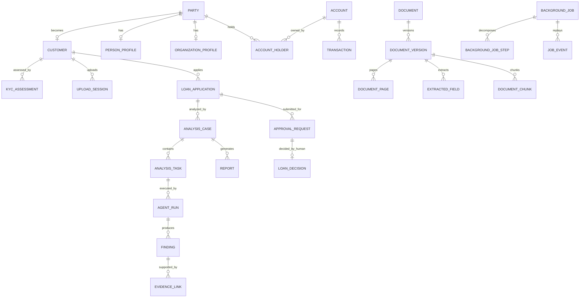

# Database design

PostgreSQL 18 with pgvector is the authoritative business store. The same
instance hosts two isolated databases: `bank_ai` for the workbench and
`keycloak` for Keycloak. The `keycloak_app` role can connect only to `keycloak`;
workbench runtime roles cannot use that database.

## Schemas and ownership

| Schema | Responsibility | Principal records |
| --- | --- | --- |
| `identity` | Employee business identity, roles, permissions and scopes | branch, department, employee, role, permission, assignments |
| `customer` | Parties, customer relationships, KYC and verified income | party/profile, identifiers, contacts, employment, KYC |
| `banking` | Accounts, transactions and externally sourced credit facilities | account, monthly summary, credit report/facility |
| `storage` | Metadata and retention for MinIO objects | object metadata, upload session, retention rule |
| `document` | Logical documents, versions and normalized extraction | pages, fields, chunks, issues and processing jobs |
| `credit` | Loan application, affordability, policy checks and human decisions | application, collateral, calculations, decision, loan account |
| `policy` | Versioned policy sources, clauses and checklist rules | policy/version/clause/rule/requirement |
| `ai` | Conversations, bounded agent work, evidence and reports | analysis case/task/run, finding, evidence, validation, report |
| `integration` | Durable asynchronous coordination | job/steps/history, outbox, inbox, idempotency, notification |
| `audit` | Append-only security and business audit chain | audit_event |

Objects are owned by the migration owner. `bank_migrator` performs DDL but is
not a runtime identity. `bank_app`, `bank_worker`, and `bank_readonly` are
`NOSUPERUSER NOCREATEDB NOCREATEROLE NOREPLICATION NOBYPASSRLS` and never own
schemas/tables. `bank_worker` cannot write `credit.loan_decision`. For business
data, `bank_readonly` receives only masked views; its predefined `pg_monitor`
membership exists solely for PostgreSQL exporter system statistics.

## Extensions and types

The `bank_ai` database enables `vector`, `pgcrypto`, `citext`, and `uuid-ossp`.
Business IDs are UUIDs. Money uses `NUMERIC(24,4)`, ratios use
`NUMERIC(12,8)`, timestamps use UTC `TIMESTAMPTZ`, and currencies use `CHAR(3)`.
Binary PDFs/images are never stored in PostgreSQL. Mutable business entities use
an integer optimistic-lock `version` where defined by the contract.

Identifiers/contact values are encrypted in `BYTEA` and searched by a
deterministic 64-character hash; only masked fragments are exposed. Object keys,
Kafka payloads and audit metadata must not contain direct identifiers.

## Main relationships



The diagram abbreviates schema-qualified names for readability; the exact table
and column inventory is in [data-dictionary.md](data-dictionary.md).

## Transaction and event consistency

Any state transition that emits an event writes business state,
`integration.background_job` (when applicable), and
`integration.event_outbox` in one PostgreSQL transaction. A publisher leases
pending rows using `FOR UPDATE SKIP LOCKED`, publishes the schema-versioned Kafka
envelope, then marks the outbox row published. Consumers insert
`integration.event_inbox(event_id, consumer_name)` before effects; its unique
constraint makes redelivery idempotent. API request idempotency is independent
and uses `integration.idempotency_record`.

Kafka and Redis never supersede these durable records. `integration.job_event`
provides ordered replay for reconnecting SSE clients.

## Partitioning and indexing

`banking.transaction` is range-partitioned monthly on `booking_time` and uses a
composite primary key `(id, booking_time)`. Migrations create partitions covering
the previous and current calendar years plus a default partition; the partition
maintenance script creates future months. Each partition has:

- B-tree `(account_id, booking_time DESC)` and
  `(transaction_type, booking_time DESC)` indexes;
- B-tree `counterparty_account_hash` index; and
- BRIN `booking_time` index for long time-range scans.

`document.document_version` has a partial unique index enforcing one current
version per document. `document.document_chunk` and `policy.policy_clause` use
HNSW cosine indexes for non-null 1,024-dimensional embeddings and relational
scope filters must be applied before/with vector retrieval. JSONB metadata has
GIN indexes where specified. Outbox scheduling uses
`(status, available_at, created_at)`.

## Row-level security

RLS is enabled for the protected tables listed below; runtime roles are
non-owners without `BYPASSRLS`, so the policies apply to them:

- customer: `customer`, `party_identifier`, `party_contact`;
- banking: `account`, `transaction`;
- document: `document`, `document_version`, `extracted_field`;
- credit: `loan_application`, `loan_decision`;
- AI: `conversation`, `analysis_case`, `finding`, `report`.

Every backend transaction sets:

```sql
SET LOCAL app.employee_id = '<uuid>';
SET LOCAL app.branch_id = '<uuid>';
SET LOCAL app.is_admin = 'false';
```

Policies call `identity.current_employee_id()`,
`identity.current_branch_id()`, `identity.current_is_admin()`,
`identity.can_access_customer(...)`, and `identity.can_access_loan(...)`.
Missing or malformed context denies access; there is no permissive fallback.
Administrative bypass is an application scope decision, not PostgreSQL
`BYPASSRLS`.

## Masked read models

For business data, `bank_readonly` receives only these views:
`customer.v_customer_summary`,
`banking.v_account_masked`, `banking.v_transaction_summary`,
`document.v_document_summary`, `credit.v_loan_application_summary`, and
`ai.v_report_summary`. They exclude encrypted values, secrets, full account
numbers and sensitive raw payloads. `pg_monitor` grants exporter visibility into
server statistics, not application-table write access.

## Audit integrity

`audit.audit_event` is append-only. Runtime grants exclude `UPDATE`, `DELETE`,
and `TRUNCATE`, and a trigger rejects attempted mutations. Each event stores its
`previous_hash` and `event_hash` to support tamper-evident chain verification.
Authentication tokens, passwords, API keys, complete identity numbers and full
document content are forbidden in audit metadata.

## Retention model

Retention is policy-driven rather than hard-coded deletion of business rows.
`storage.retention_rule` defines the duration/start event and
`storage.resource_retention` records calculated deadlines and legal holds.
Application tables are archived/soft-deleted where applicable. Audit data is
append-only and may be copied to `audit-archive`; object deletion must honor the
PostgreSQL retention record and legal hold. Temporary integration/idempotency
rows may be purged only after their operational replay windows.

## Migration rules

Flyway applies versioned migrations in order and records checksums in its schema
history. Repeatable seed scripts are idempotent. Do not edit an applied migration
or repair checksum history to conceal drift: add a new versioned migration.
Backup both databases and MinIO before an incompatible schema or image upgrade.
