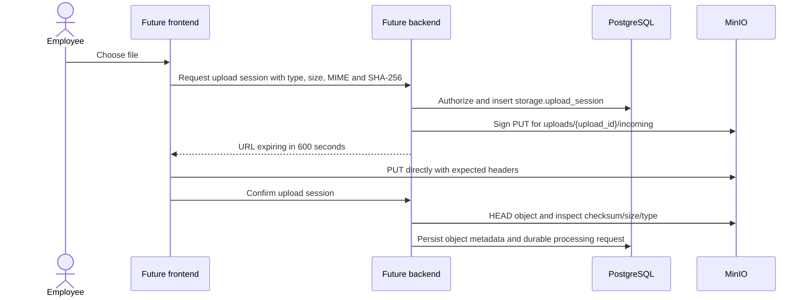

# MinIO layout and access contract

MinIO stores binary objects; PostgreSQL `storage.object_metadata` stores their
checksum, version, size, media type, location and retention metadata. Every
bucket is private. Anonymous list/read/write is forbidden, and root credentials
are used only by bootstrap/administration—not by application runtime.

## Buckets

| Bucket | Purpose | Versioning | Object Lock | Lifecycle / retention | Runtime writers |
| --- | --- | --- | --- | --- | --- |
| `upload-quarantine` | Untrusted incoming upload staging | Off | Off | Delete current objects after 3 days; abort incomplete multipart uploads after 1 day | `bank-api` |
| `customer-doc-original` | Immutable logical originals after validation | On | Off | No automatic deletion; PostgreSQL retention record and legal hold control removal | `document-worker` |
| `customer-doc-derived` | Page images, normalized OCR JSON and redacted derivatives | Off | Off | Configured expiry applies only to objects tagged `retention-status=eligible` after a PostgreSQL hold check | `document-worker` |
| `policy-documents` | Original policy PDFs and parsed policy representation | On | Off | Preserve policy history; deletion follows approved retention/hold process | `policy-worker` |
| `generated-reports` | Versioned report JSON/PDF artifacts | On | Off | Preserve report versions; deletion follows PostgreSQL retention/hold process | `report-worker` |
| `audit-archive` | Batched append-oriented audit archive | On | On at bucket creation | No automatic deletion locally; supports append/version history and object-level legal hold | `audit-writer` |

Versioning status and lifecycle rules are bootstrapped idempotently and verified
by smoke tests. Object Lock can only be enabled when a bucket is created; a
deployment requiring it must create `audit-archive` accordingly before writes.

## Object-key grammar

Only opaque IDs and structural labels are permitted. Keys never contain customer
names, identity numbers, account numbers, email addresses, phone numbers or the
original filename.

```text
upload-quarantine/
  uploads/{upload_id}/incoming

customer-doc-original/
  documents/{document_id}/versions/{document_version_id}/original

customer-doc-derived/
  documents/{document_id}/versions/{document_version_id}/ocr/result.json
  documents/{document_id}/versions/{document_version_id}/pages/0001.png
  documents/{document_id}/versions/{document_version_id}/redacted/preview.pdf

policy-documents/
  policies/{policy_id}/versions/{policy_version_id}/original.pdf
  policies/{policy_id}/versions/{policy_version_id}/parsed.json

generated-reports/
  analysis-cases/{analysis_case_id}/reports/{report_id}/v{version}/report.pdf
  analysis-cases/{analysis_case_id}/reports/{report_id}/v{version}/report.json

audit-archive/
  audit/{yyyy}/{mm}/{dd}/events-{batch_id}.jsonl
```

The client-supplied filename is metadata in PostgreSQL only. On upload
confirmation, size, MIME type and SHA-256 must match `storage.upload_session`;
the resulting ETag/version ID is persisted in `storage.object_metadata`.

## Service accounts and policies

| Account | Allowed actions | Explicit restrictions |
| --- | --- | --- |
| `bank-api` | Create presigned operations after business authorization; put into `upload-quarantine`; read authorized objects/reports; get/set tags only on `customer-doc-derived/documents/*` as the retention control plane | No `DeleteObject`; no bucket-policy administration; no audit deletion; no unrestricted root use |
| `document-worker` | Read quarantine, copy/write original, read original, write derived artifacts | No policy/report/audit writes; no bucket administration |
| `policy-worker` | Read/write approved paths in `policy-documents`, including parsed representation | No customer document, report or audit access |
| `report-worker` | Write `generated-reports`; evidence is obtained via an authorized backend/service contract | No direct broad customer-document access; no audit deletion |
| `audit-writer` | Put new objects into `audit-archive` | No bucket administration or deletion; no overwrite when Object Lock applies |

Policy JSON is scoped to exact bucket ARNs and required actions. Bootstrap must
not grant `s3:*`, must not embed credentials, and must verify a permitted action
as well as a denied cross-bucket/anonymous action. Service account secrets come
from `.env.local` keys:

- `MINIO_BANK_API_SECRET_KEY`
- `MINIO_DOCUMENT_WORKER_SECRET_KEY`
- `MINIO_POLICY_WORKER_SECRET_KEY`
- `MINIO_REPORT_WORKER_SECRET_KEY`
- `MINIO_AUDIT_WRITER_SECRET_KEY`

`MINIO_ROOT_PASSWORD` is bootstrap-only. The browser receives none of these.

## Presigned upload flow



Downloads follow the same authorization rule: the backend resolves an opaque
resource ID, checks RLS/business permissions, and signs one exact object/version
for at most 600 seconds. The browser cannot list buckets or choose arbitrary
keys. Presigned URLs must not be logged.

## CORS

Local CORS allows only:

```text
Origin: http://localhost:3000
Methods: GET, PUT, HEAD
Headers: *
Expose: ETag, x-amz-version-id
```

CORS is not authorization. A request still needs a valid presigned URL, and
bucket anonymous policy remains denied.

## Lifecycle and legal hold behavior

Lifecycle expiry is appropriate only for disposable quarantine and configured
derived objects. The derived lifecycle filter matches exactly the object tag
`retention-status=eligible`; untagged objects do not expire. The `bank-api`
retention control-plane workflow checks
`storage.resource_retention.legal_hold = FALSE`, the calculated
`retention_until`, and object metadata before applying that tag, and records the
action in audit. Its policy grants `GetObjectTagging`/`PutObjectTagging` only on
`customer-doc-derived/documents/*` and grants no `DeleteObject`.
Removing/overwriting the eligibility tag is not a substitute for a legal-hold
record. Automatic lifecycle is not used to delete original documents or audit
archive locally. Lifecycle/tag behavior must be re-verified after MinIO upgrades.
